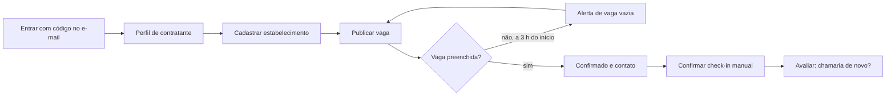
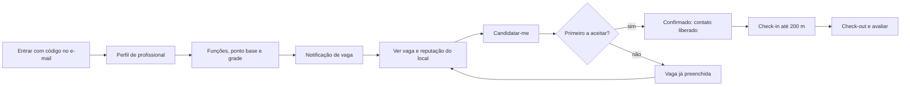

# Frila — Escopo do MVP

**Versão 1.0 · 22 de setembro de 2026**

O que entra em cada versão do Frila, o que fica fora e por quê, e como o trabalho se divide em sprints até a loja. Este documento é a fonte do quadro do Trello (https://trello.com/b/0eyqvbRJ/frila) e tem uma cópia editável em https://claude.ai/code/artifact/7c7cc595-0666-4687-a586-316e542f7d70.

---

## Resumo

O MVP do Frila é um app iOS, só no Distrito Federal, que fecha o ciclo de um turno avulso de ponta a ponta: o contratante publica a vaga com poucos campos, os profissionais perto recebem a notificação e se candidatam sem formulário, o primeiro aceito é confirmado, faz check-in no local e os dois se avaliam com Sim ou Não.

Ele vai para a App Store em 13/11/2026 (v1.0). Antes disso, o protótipo clicável é apresentado na Apple Review de 28/09 (v0.1) e um TestFlight interno fecha o ciclo em 27/10 (v0.5). Entram as 19 histórias MUST do Backlog v1.2.0, menos a parte web do Painel do gestor. Ficam para a v1.1 (dezembro) o modo seleção, a equipe de confiança e o suporte por e-mail, e para a v1.2 (1º trimestre de 2027) o Android, a web com o Painel e a escala de evento em lote.

O time tem três desenvolvedores (Cauê, João Paulo e Matheus), uma PO (Júlia) e um designer (Fabrício), e sete semanas até a loja.

## Critério de corte

Entra na v1.0 o que é preciso para um turno acontecer de ponta a ponta no iOS, no DF, e o que a App Store exige para aprovar o app. Cada história do Backlog passou por quatro perguntas, nesta ordem:

1. **Sem isso o ciclo não fecha?** Publicar, notificar, candidatar, confirmar, liberar contato, fazer check-in e avaliar entram.
2. **A App Store exige?** Excluir a conta de dentro do app (diretriz 5.1.1(v)), denunciar e bloquear (diretriz 1.2) e a política de privacidade entram.
3. **É a tese do produto?** Despacho por proximidade sem levas, reputação binária com denominador e valor integral para o profissional entram, porque são o que diferencia o Frila do grupo de WhatsApp.
4. **Só faz sentido com volume ou com outra plataforma?** Escala em lote, Painel web, Android, relatório consolidado e múltiplos membros ficam para depois.

A base é a prioridade MoSCoW do Backlog v1.2.0: MUST vai para a v1.0, SHOULD para a v1.1 e COULD para a v1.2. A única exceção é a US21: o alerta de vaga vazia e a confirmação de check-in manual entram na v1.0, no app, e o Painel web vai para a v1.2, junto com a versão web. Fora do produto continuam pagamento no app, CLT, chat, nota de 1 a 5, aval externo e operação fora do DF.

## O que entra na v1.0 (MVP)

A v1.0 é um app iOS (iOS 17 ou superior), com dois perfis e um perfil por conta, para o Distrito Federal, com o backend no Supabase. São 19 histórias e 90 pontos, todas MUST no Backlog v1.2.0.

| Épico | História | Pontos | O que o usuário consegue fazer |
|---|---|---|---|
| 1 Onboarding | US01 Cadastro do profissional | 3 | Entrar com código no e-mail, sem senha; informar nome, telefone e maioridade; perfil fixo na conta (RN25) |
| 1 Onboarding | US02 Funções, ponto base e disponibilidade | 3 | Marcar funções, ponto base e a grade semanal de horários |
| 1 Onboarding | US03 Cadastro do estabelecimento | 5 | Cadastrar nome, CNPJ ou CPF, endereço no mapa e responsável |
| 2 Publicação | US04 Publicar turno com poucos campos | 5 | Publicar com os campos da RN02 e o alerta de vaga vazia (padrão 3 h); só modo urgência na v1.0 |
| 2 Publicação | US05 Republicar vaga anterior | 3 | Repetir uma vaga mudando só data e horário |
| 3 Despacho | US07 Notificação por proximidade, teto e agrupamento | 8 | Receber a vaga se tem a função, está disponível e a até 15 km; no máximo uma notificação a cada 30 min (RN23) |
| 3 Despacho | US08 Lista de vagas do DF | 5 | Ver todas as vagas abertas, das mais próximas às mais distantes, com filtros |
| 4 Candidatura | US10 Candidatura direta | 3 | Candidatar-se da notificação ou da lista, sem formulário |
| 4 Candidatura | US11 Modo urgência | 5 | O primeiro que aceita fica com a vaga; quem perde vê "já preenchida" (RN19) |
| 4 Candidatura | US13 Contato pós-confirmação | 3 | Ver telefone e WhatsApp da outra parte só depois da confirmação e até 7 dias após o turno (RN10) |
| 5 Turno | US14 Lembrete pré-turno | 3 | Receber lembrete 24 h e 3 h antes |
| 5 Turno | US15 Check-in e check-out geolocalizados | 8 | Registrar presença a até 200 m; check-in manual confirmado pelo contratante (RN22) |
| 5 Turno | US16 Cancelamento com reabertura | 5 | Cancelar com motivo; a vaga reabre e notifica de novo |
| 5 Turno | US21 Alerta de vaga vazia (parte do app) | 8 | Contratante recebe alerta 3 h antes se a vaga seguir vazia e confirma check-in manual no app; o Painel web fica para a v1.2 |
| 6 Reputação | US17 Avaliação binária | 5 | Responder "chamaria de novo?" ou "trabalharia lá de novo?" após turno com presença verificada |
| 6 Reputação | US18 Reputação com denominador | 5 | Ver "7 de 7 chamariam de novo" e a taxa de comparecimento no perfil |
| 6 Reputação | US26 Denunciar e bloquear | 5 | Denúncia com motivo para a Equipe Frila; bloqueio imediato (App Store 1.2) |
| 7 Direitos | US23 Contestação de suspensão | 5 | Conta suspensa vê o motivo e contesta; resposta em até 5 dias úteis |
| 7 Direitos | US25 Exportar dados e excluir conta | 3 | Excluir a conta de dentro do app (App Store 5.1.1(v)); dados apagados em até 15 dias |

Também fazem parte da v1.0, sem história própria: a política de privacidade e os termos de uso publicados, o texto "Por que recebo vagas" no perfil (a explicação, sem o botão Contestar), leitura offline dos turnos confirmados (RNF06), acessibilidade com VoiceOver e Dynamic Type (RNF10) e a telemetria mínima para medir o piloto.

## O que fica fora do MVP

Oito histórias do Backlog e três plataformas ficam para depois da loja. Nenhuma delas impede um turno de acontecer no DF pelo iPhone.

| Item | História | Por que fica fora da v1.0 | Entra em |
|---|---|---|---|
| Modo seleção | US12 (5 pt) | Só faz sentido para vaga com mais de 24 h; o piloto começa pela urgência, que é a dor do bar na sexta. Exige escolher candidato e fechar a vaga sozinho (RN24) | v1.1 |
| Equipe de confiança | US09 (5 pt) | Precisa de histórico: ninguém tem equipe no primeiro mês | v1.1 |
| Explicação do despacho e pedido de revisão | US27 (3 pt) | O texto estático entra na v1.0; o botão Contestar e o fluxo com a Equipe Frila ficam para depois (LGPD art. 20) | v1.1 |
| Suporte por e-mail a partir do turno | US22 (5 pt) | Na v1.0 o e-mail de suporte aparece no perfil; o atalho com os dados do turno vem depois | v1.1 |
| Relatório consolidado de turnos | US20 (5 pt) | Precisa de turnos acumulados; nenhum contratante terá mês fechado antes de dezembro | v1.1 |
| Painel do gestor na web | parte da US21 | Depende da versão web, cuja tecnologia será escolhida depois do iOS | v1.2 |
| Escala de evento em lote | US06 (8 pt) | É a persona da produtora, que planeja no computador; entra com a web | v1.2 |
| Múltiplos membros por estabelecimento | US24 (3 pt) | COULD no Backlog; no piloto, um responsável por estabelecimento basta | v1.2 |
| Android | plataforma | Prioridade de alcance, mas o time tem três devs e sete semanas; o iOS é o mínimo para a loja em 13/11 (B03) | v1.2 |
| Web | plataforma | Tecnologia a escolher depois do iOS | v1.2 |
| Freelance remoto | escopo | Sem presença não há check-in nem notificação por distância; fica para depois do MVP | depois da v1.2 |

Fora do produto, sem data: pagamento dentro do app (RN09), contratação CLT e processo seletivo, chat interno, nota de 1 a 5, aval de fora da plataforma, rede social e operação fora do DF antes da consolidação.

## Versões e iterações

| Versão | Data | Pergunta que responde | Conteúdo |
|---|---|---|---|
| v0.1 Protótipo | 28/09/2026 (Apple Review 1) | O fluxo faz sentido para quem publica e para quem trabalha? | Protótipo clicável de 17 telas em tons de cinza, validado com o time; Solution Concept e pitch (T-0014) |
| v0.5 TestFlight interno | 27/10/2026 | O ciclo fecha de ponta a ponta com push de verdade? | Backend com as funções do ciclo, despacho por proximidade, push pelo FCM, telas de cadastro, publicação, lista, candidatura, confirmação, contato e check-in; só o time e até 10 convidados |
| v1.0 MVP | 13/11/2026 (App Store; submissão em 06/11; Apple Review 2 em 10/11) | Um estabelecimento do DF preenche uma vaga real pelo Frila? | As 19 histórias MUST, avaliação e reputação, denúncia e bloqueio, exclusão de conta, política de privacidade, acessibilidade, leitura offline, telemetria do piloto |
| v1.1 | dezembro/2026 (antes do encerramento do CBL, 04/12) | O que o piloto pediu primeiro? | Modo seleção (US12), equipe de confiança (US09), Contestar no despacho (US27), suporte a partir do turno (US22), relatório de turnos (US20), correções do piloto, início do Android |
| v1.2 | 1º trimestre de 2027 | O Frila alcança quem está no Android e quem planeja no computador? | Android na Play Store, versão web com o Painel do gestor (US21), escala em lote (US06), múltiplos membros (US24) |

A v1.1 só começa depois da loja: até 13/11 toda a capacidade do time vai para a v1.0. O que o piloto mostrar entre 13/11 e 04/12 reordena a v1.1; a lista acima é o ponto de partida, não um compromisso.

## Fluxos de uso da v1.0

Dois fluxos, um por perfil, que se encontram na vaga. Cada caixa é uma tela do protótipo clicável.

O contratante publica e espera: o Frila notifica quem está perto e o avisa se a vaga seguir vazia. Ele só volta a agir para confirmar um check-in manual e para avaliar.

O profissional recebe, decide e vai. Perder a corrida no modo urgência é normal e a tela diz isso sem culpa; ele volta à lista de vagas do DF.

| Passo | Tela do protótipo | História |
|---|---|---|
| Entrar com código no e-mail | Entrada, Código | US01, US03 |
| Escolher perfil e dados | Perfil e dados | US01, US03 (RN25) |
| Cadastrar estabelecimento | Estabelecimento | US03 |
| Publicar vaga | Publicar vaga | US04, US05 |
| Acompanhar vagas e alerta | Minhas vagas | US21 |
| Funções, ponto base e grade | Funções e horários | US02 |
| Notificação de vaga | Notificação | US07 |
| Ver vaga e reputação | Vagas no DF, Detalhe da vaga | US08, US18 |
| Candidatar-me e resultado | Detalhe da vaga, Vaga preenchida, Meu turno | US10, US11 |
| Contato liberado | Meu turno, Turno confirmado | US13 |
| Check-in, check-out e manual | Meu turno, Turno confirmado | US15 |
| Avaliar | Avaliar local, Avaliar profissional | US17 |
| Perfil, denúncia, bloqueio, excluir conta | Meu perfil, Candidata | US18, US26, US25 |

As 26 histórias completas, com narrativa e cenários BDD, estão na coluna "Histórias de usuário" do quadro do Trello e no Backlog v1.2.0.

## Sprints até a loja

Quatro sprints de 22/09 a 13/11. O Sprint 0 é de fundação e termina no marco que o FigJam já marcava (05/10); os outros têm duas semanas, e o último é mais curto porque termina na loja. Cada sprint tem uma pergunta que responde e o backend anda uma etapa à frente do iOS.

| Sprint | Datas | Pergunta que responde | Entregas principais | Cartões |
|---|---|---|---|---|
| Sprint 0 · Fundação | 22/09 a 05/10 | Temos base para construir sem retrabalho? | Protótipo validado e Apple Review 1 (28/09); sistema de design e telas de alta fidelidade; projeto Supabase, migrações, RLS e autenticação por e-mail; projeto Xcode e cliente da API; contas Apple e Firebase; decisão do C09; 10 entrevistas de campo; termos, política e parecer jurídico; plano de métricas | 21 |
| Sprint 1 · Ciclo principal | 06/10 a 19/10 | O ciclo fecha no simulador, sem push? | Todas as RPCs do ciclo (perfil, estabelecimento, publicar, vagas, candidatar com RN19, contato, check-in, avaliar, cancelar) com testes pgTAP; iOS: entrada, cadastros, publicar, lista, detalhe, candidatura, meu turno, minhas vagas, cache offline | 23 |
| Sprint 2 · Despacho e turno | 20/10 a 02/11 | O ciclo fecha em aparelho real, com push, para gente de fora? | Motor de despacho com teto e agrupamento; push pelo FCM; lembretes, atraso, vaga vazia, não verificado; check-in com GPS; avaliação e reputação; denúncia, bloqueio, suspensão, exclusão de conta; e-mails; telemetria; TestFlight v0.5 em 27/10 e testes de usabilidade | 25 |
| Sprint 3 · Loja | 03/11 a 13/11 | A Apple aprova e o piloto começa? | Correções, acessibilidade, desempenho, produção, ficha da loja e App Privacy, regressão, submissão em 06/11, Apple Review 2 em 10/11, lançamento e piloto em 13/11, marketing, painel de métricas, operação da Equipe Frila | 15 |

Depois da loja, a coluna Backlog v1.1 tem 10 cartões e a v1.2 tem 7. Se o Sprint 2 atrasar, o corte segue esta ordem, sem tocar no ciclo nem no que a App Store exige: republicar vaga (US05), aviso de hora excedida, lembrete de 24 h (fica só o de 3 h) e exportar dados (excluir conta fica). Nunca saem: candidatura e confirmação, check-in, avaliação, denúncia e bloqueio, exclusão de conta.

## Riscos e dependências

| Risco | Efeito se acontecer | Mitigação | Quem / até quando |
|---|---|---|---|
| Conta Apple e chave APNs atrasam (depende do C09) | Push só testado em aparelho no fim do Sprint 2; TestFlight de 27/10 sem notificação | Decidir o C09 e pagar a conta até 29/09; App ID e chave APNs até 30/09 | Cauê, 30/09 |
| Parecer jurídico não chega (C01, C03, C07, C12) | Piloto com gente de verdade sem saber a natureza da relação e a responsabilidade do Frila | Briefing de uma página e parecer preliminar até 05/10; termos escritos com a hipótese mais conservadora | Júlia, 05/10 |
| Construir sem validar em campo | Descobrir em novembro que o contratante não publica ou o profissional não aceita | 10 entrevistas no Sprint 0 e recrutamento do piloto no Sprint 1 | Júlia, 05/10 |
| Corrida da confirmação errada (RN19) | Duas pessoas confirmadas para a mesma posição | UPDATE condicional dentro da função e teste com 20 candidaturas simultâneas no Sprint 1 | Cauê, 19/10 |
| Push não chega no iPhone | Sem notificação o produto não existe | Pedir permissão com explicação depois do perfil pronto; testar em aparelho real no Sprint 2; medir RNF02 e RNF03 no servidor | João Paulo e Matheus, 02/11 |
| Capacidade: 90 pontos e 60 tarefas técnicas para três devs em sete semanas | Sprint 2 estoura e a submissão de 06/11 atrasa | Ordem de corte definida; backend uma etapa à frente do iOS; revisão do plano em cada fim de sprint | Time, a cada sprint |
| Rejeição na App Review | Uma rodada de rejeição consome 2 a 4 dias | Submissão em 06/11 com margem; checklist das diretrizes 1.2, 2.1, 2.3, 5.1.1 e 5.1.2; conta de demonstração para o revisor | Cauê e Júlia, 06/11 |
| E-mail do código de entrada cai em spam | Ninguém consegue entrar no app | Provedor próprio com SPF, DKIM e DMARC; teste em Gmail e iCloud no Sprint 2 | Cauê, 02/11 |

Dependências externas fora do controle do time: aprovação da Apple, entrega do FCM e da APNs, disponibilidade do Supabase no horário de pico (RNF12) e a agenda dos estabelecimentos do piloto.

## O quadro do Trello

O quadro tem 2 cartões de leitura, 26 histórias de usuário e 101 tarefas (84 até a loja, 17 depois). Cada tarefa tem etiquetas, responsável sugerido, história ou requisito, contexto, o que fazer, critérios de aceite e referências.

| Coluna | O que tem | Como usar |
|---|---|---|
| Leia primeiro | Como usar o quadro; documentos e links | Ler antes de pegar o primeiro cartão |
| Histórias de usuário | As 26 US do Backlog v1.2.0, com narrativa, cenários BDD e a versão em que entram | Referência: não se move. Cada tarefa técnica cita a US que atende |
| Sprint 0 a Sprint 3 | As tarefas de cada sprint, em ordem de prioridade | É o "a fazer" do sprint; quem começa move para Em andamento |
| Backlog v1.1 e v1.2 | O que fica para depois da loja | Reordenado com o que o piloto mostrar |
| Em andamento, Revisão, Teste, Concluído | O fluxo de quem está fazendo | Um cartão em andamento por dev; revisão por outra pessoa; teste marca os critérios de aceite |

O nome de cada cartão carrega o sprint e a área (`S1 · Backend · …`). As etiquetas estão na primeira linha da descrição (`#backend #must #epico-4`), porque a integração usada para montar o quadro não cria etiquetas coloridas; para tê-las, basta criar no menu do quadro as de área (Backend, iOS, Design, Produto, Pesquisa, Jurídico, Infra, QA) e as de prioridade (MUST, SHOULD, COULD). O prazo de cada cartão é o fim do sprint, salvo os marcos fixos: 28/09, 27/10, 06/11, 10/11 e 13/11.

Responsáveis são sugestão, não atribuição: Cauê no backend e na infra, João Paulo e Matheus no iOS e no backend, Fabrício no design, Júlia em produto, pesquisa e jurídico.

---

**Fontes:** Documento de Requisitos v1.3.0, Documento de Visão v1.2.0, Histórias de Usuário e Backlog v1.2.0, contrato da API 0.2.0, notas de arquitetura do vault (Arquitetura, Classe, Banco, Casos de Uso, Pendências Técnicas), quadro 03 do FigJam e as tarefas T-0010 a T-0024. As datas dos marcos vêm do calendário do CBL C18.

---
← [[01 - CBL/00 - Índice CBL|Índice CBL]]
