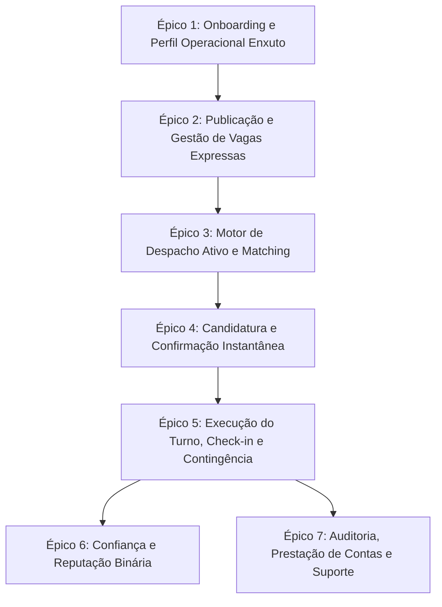

# 📋 Histórias de Usuário e Backlog do Produto — Frila

> **Documento de Engenharia de Requisitos & Produto**
> **Autores**: Júlia Clovandi (Product Owner) e Fabrício Tosta (Product Designer)
> **Equipe BlendOps**: Cauê Carneiro, Fabrício Tosta, João Paulo, Júlia Clovandi, Matheus Silva
> **Desafio**: CBL C18 — Apple Developer Academy (UCB)
> **Data**: 22 de setembro de 2026 | **Versão**: v1.1.0

---

## Histórico de Versões

| Versão | Data | Autor(es) | Descrição da Mudança |
|---|---|---|---|
| v1.0.0 | 17/09/2026 | Júlia Clovandi & Fabrício Tosta | Criação do Backlog do Produto com 25 Histórias de Usuário priorizadas via MoSCoW e especificadas em formato BDD (INVEST), derivadas da Especificação de Requisitos v1.0.0 e do Documento de Visão v1.0.0 para orientar o protótipo de baixa fidelidade e o MVP. |
| v1.1.0 | 22/09/2026 | Cauê Carneiro | Aplica as respostas do quadro 03 de pendências (21 e 22/09), alinhado à Especificação de Requisitos v1.2.0 e ao Documento de Visão v1.1.0: despacho por proximidade (até 15 km), sem raio configurável e sem levas, com teto de notificações; check-in geolocalizado a 200 m com confirmação manual; avaliação só com presença verificada; aval herdado retirado (US19); persona interna retirada, com Painel do gestor na web e Equipe Frila só por e-mail; modo seleção com fechamento automático; novas US26 (denúncia e bloqueio) e US27 (explicação do despacho); referências de RF e RN corrigidas; metas de tempo de publicação e de número de toques retiradas até haver medição no piloto. |

## Glossário e Metodologia

| Termo / Conceito | Definição | Aplicação no Frila |
|---|---|---|
| INVEST | Critérios de qualidade para histórias ágeis: Independente, Negociável, Valiosa, Estimável, Pequena e Testável. | Todas as 26 histórias de usuário ativas |
| MoSCoW | Framework de priorização: Must Have (obrigatório), Should Have (desejável), Could Have (futuro), Won't Have (fora de escopo). | Classificação do backlog do MVP |
| BDD | Behavior-Driven Development: cenários de comportamento verificáveis no formato Dado / Quando / Então. | Critérios de aceitação de cada história |
| Turno avulso | Jornada pontual de trabalho avulso (diária), sem vínculo continuado. É o núcleo atômico do sistema. | Entidade central do modelo |
| Despacho ativo | Motor que envia a vaga, de uma vez, aos profissionais elegíveis: com a função, disponíveis no horário e a até 15 km do local, mais a equipe de confiança do estabelecimento. No máximo uma notificação a cada 30 minutos por profissional. | Épico 3 (Motor de Despacho) |
| No-show | Furo de comparecimento: profissional confirmado que não aparece no início do turno. Conta como falta na taxa de comparecimento e não é avaliado. | Épicos 5 e 6 (Mitigação e reputação) |
| Reputação binária | Avaliação mútua simplificada baseada na pergunta 'Chamaria de novo?', exibida com denominador, só entre quem trabalhou junto e com presença verificada. | Épico 6 (Reputação) |
| Taxa de comparecimento | Turnos com presença divididos pelos turnos confirmados. Falta é não aparecer ou cancelar com menos de 24 h do início; turno não verificado não entra na conta. | US17, US18 |
| Equipe Frila | Pessoas do time que respondem, por e-mail, suporte, denúncias, contestações e pedidos de revisão do despacho, em até 5 dias úteis. Não acompanham turnos. | US22, US23, US26, US27 |

## 1. Visão Geral e Metodologia

Este documento consolida a tradução funcional do [[01 - CBL/Desafios/C18/Documentos de Produto/Frila_Documento_de_Visao|Documento de Visão]] e da [[01 - CBL/Desafios/C18/Documentos de Produto/Frila_Documento_de_Requisitos|Especificação de Requisitos]] em Histórias de Usuário (User Stories) orientadas a valor e em um Backlog do Produto priorizado via MoSCoW. O objetivo primordial é municiar a engenharia de software (Cauê Carneiro, JP e Matheus Silva) com especificações de comportamento verificáveis (BDD) e o design de produto (Fabrício Tosta) com os fluxos operacionais necessários para a prototipagem de baixa fidelidade (T-0011) e o MVP a ser apresentado na 1ª Apple Review em 28/09/2026.

### 1.1 Critérios de Qualidade (INVEST)

Todas as histórias de usuário foram estruturadas segundo o acrônimo INVEST:

- **I (Independent)**: Redução ao máximo de acoplamento direto entre histórias para viabilizar entregas paralelas.
- **N (Negotiable)**: Espaço para ajustes de implementação acordados entre PO e engenharia.
- **V (Valuable)**: Benefício concreto e perceptível gerado para uma persona real do ecossistema.
- **E (Estimable)**: Escopo delimitado por critérios de aceitação objetivos em BDD.
- **S (Small)**: Granularidade adequada para sprints curtos de 1 a 2 semanas.
- **T (Testable)**: Critérios de aceitação binários no padrão Dado / Quando / Então.

### 1.2 Personas Mapeadas

| Persona | Perfil Operacional | Dor Central | Ganho Esperado no Frila |
|---|---|---|---|
| **Marcos (Gerente de Salão)** | Contratante de Food Service em bar/restaurante de alto giro (40 turnos/mês). | Garçom faltou na sexta às 18h; WhatsApp é caótico e grupos não dão garantia de comparecimento. | Publicar turno com poucos campos, saber antes de confirmar se a pessoa costuma aparecer e ser avisado se a vaga seguir vazia perto do horário. |
| **Carla (Produtora de Eventos)** | Contratante de Eventos / Staff em Lote para congressos e festas. | Precisa fechar equipe de 15 pessoas para montagem/bar e prestar contas sem risco fiscal. | Escala em lote e relatório consolidado auditável de presença e valores combinados. |
| **Lucas (Garçom Freelancer)** | Profissional Operacional Avulso com experiência em salão. | Não fica sabendo das vagas a tempo; cansa de preencher cadastros longos e de levar calote ou pagar taxas. | Notificação direta no bolso com vaga perto de casa, candidatura sem formulário e o valor integral da diária, sem comissão. |

> A persona interna de operação saiu na v1.1.0: o Frila não tem plantão nem operação manual de turnos. Quem acompanha vagas e turnos é o gestor do estabelecimento (Marcos ou Carla), pelo Painel na versão web; a Equipe Frila só responde e-mail.

## 2. Estrutura de Épicos do Produto

O backlog do Frila divide-se em 7 Épicos centrais que cobrem a jornada completa das duas pontas:

| Épico | Nome do Épico | Objetivo Primário | Requisitos Atendidos |
|---|---|---|---|
| **ÉPICO 1** | Onboarding e Perfil Operacional Enxuto | Garantir entrada atrito zero para o profissional e validação cadastral expressa. | RF01, RF02, RF03, RF21, RF25 |
| **ÉPICO 2** | Publicação e Gestão de Vagas Expressas | Permitir que o contratante lance uma vaga com poucos campos ou reutilize vagas anteriores. | RF04, RF05, RF19 |
| **ÉPICO 3** | Motor de Despacho Ativo e Matching | Notificar a vaga, de uma vez, a quem tem a função, está disponível e está a até 15 km, com teto de notificações, listar todas as vagas do DF e explicar o critério ao profissional. | RF06, RF07, RF18, RF27 |
| **ÉPICO 4** | Candidatura e Confirmação Instantânea | Possibilitar candidatura sem formulário, confirmação automática no modo urgência e liberação imediata de contato direto. | RF08, RF09, RF10, RF11 |
| **ÉPICO 5** | Execução do Turno, Check-in e Contingência | Mitigar no-show com lembretes pré-turno, check-in geolocalizado e reabertura rápida. | RF12, RF13, RF14 |
| **ÉPICO 6** | Confiança e Reputação Binária | Gerar reputação justa pós-turno ('Chamaria de novo?') com denominador visível, só entre quem trabalhou junto e com presença verificada. | RF15, RF16 |
| **ÉPICO 7** | Auditoria, Prestação de Contas e Suporte | Oferecer relatório consolidado auditável, alerta de vaga vazia e Painel do gestor, suporte por e-mail, denúncia e bloqueio, e respeito total à LGPD. | RF20, RF22, RF23, RF24, RF26 |

---

## 3. Detalhamento das Histórias de Usuário (US01 a US27)

A US19 foi retirada na v1.1.0 e o número fica reservado. As US26 e US27 entraram na mesma versão.

### ÉPICO 1: Onboarding e Perfil Operacional Enxuto

#### US01: Cadastro Simples do Profissional com Declaração de Maioridade
- **Persona**: Lucas (Profissional Freelancer)
- **RF / RN**: RF01, RN14, RN15, RN20 | **Prioridade**: MUST HAVE | **Pontos**: 3
- **Narrativa**:
  > **Como** profissional freelancer operacional,  
  > **quero** me cadastrar no aplicativo informando apenas meu nome, telefone, e-mail e confirmando ter 18 anos ou mais,  
  > **para que** eu possa começar a receber convites de trabalho sem atritos burocráticos e sem expor fotos de documentos desnecessariamente.  
- **Critérios de Aceitação (BDD)**:
  - **Cenário 1: Cadastro realizado com sucesso**  
    *Dado que* o profissional faz o primeiro acesso ao Frila iOS,  
    *quando* ele informa nome completo, telefone válido, e-mail, senha e marca o checkbox de confirmação de maioridade (≥ 18 anos),  
    *então* a conta é criada no estado ativo, o token de sessão é salvo no Keychain e ele é encaminhado para a definição de funções operacionais.
  - **Cenário 2: Tentativa de cadastro de menor de idade**  
    *Dado que* um usuário tenta avançar sem confirmar o checkbox de maioridade legal (RN20),  
    *quando* ele toca em 'Continuar',  
    *então* o sistema bloqueia o envio e exibe a mensagem de que a plataforma é exclusiva para maiores de 18 anos.
  - **Cenário 3: Minimização de dados (LGPD)**  
    *Dado que* o fluxo de cadastro do profissional é apresentado,  
    *quando* o formulário é renderizado na tela,  
    *então* nenhuma foto de documento (RG/CNH) ou selfie com documento é solicitada, em estrito cumprimento da RN14.

---

#### US02: Configuração de Funções, Ponto Base e Disponibilidade
- **Persona**: Lucas (Profissional Freelancer)
- **RF / RN**: RF03, RN05 | **Prioridade**: MUST HAVE | **Pontos**: 3
- **Narrativa**:
  > **Como** profissional freelancer,  
  > **quero** selecionar as funções que sei desempenhar, meu ponto base e os dias/turnos em que tenho disponibilidade, e marcar quando estou disponível agora,  
  > **para que** eu só seja notificado sobre vagas pertinentes ao meu trabalho, no meu horário e perto de onde estou.  
- **Critérios de Aceitação (BDD)**:
  - **Cenário 1: Seleção de funções operacionais**  
    *Dado que* o profissional está na tela de configuração de perfil,  
    *quando* seleciona pelo menos uma função do catálogo oficial (ex: Garçom, Bartender), informa o ponto base e marca a grade semanal de disponibilidade,  
    *então* os critérios de elegibilidade daquele perfil passam a valer na próxima notificação, sem novo login; a distância até a vaga (até 15 km) é calculada a partir do ponto base, e não há raio a configurar.
  - **Cenário 2: Disponível agora**  
    *Dado que* o profissional está livre fora da grade semanal,  
    *quando* toca em 'Disponível agora',  
    *então* ele passa a receber notificações de vagas da sua função perto do ponto base até desligar a opção.
  - **Cenário 3: Perfil sem funções selecionadas**  
    *Dado que* o profissional desmarca todas as funções operacionais,  
    *quando* tenta salvar o perfil,  
    *então* o sistema alerta que é obrigatório manter ao menos uma função ativa para receber despachos.

---

#### US03: Cadastro Ágil do Estabelecimento Contratante
- **Persona**: Marcos (Gerente de Salão) / Carla (Produtora)
- **RF / RN**: RF02, RN15, RN20 | **Prioridade**: MUST HAVE | **Pontos**: 5
- **Narrativa**:
  > **Como** gestor de estabelecimento ou produtor de eventos,  
  > **quero** cadastrar meu restaurante ou negócio, de qualquer setor, com CNPJ (ou CPF, quando for pessoa física), Razão Social, Nome Fantasia, endereço completo e contato do responsável,  
  > **para que** eu possa publicar vagas com identificação institucional clara e localização precisa para check-in dos profissionais.  
- **Critérios de Aceitação (BDD)**:
  - **Cenário 1: Cadastro completo com endereço georreferenciado**  
    *Dado que* o gestor informa CNPJ válido e dados do estabelecimento,  
    *quando* o sistema valida o CNPJ e obtém as coordenadas geográficas exatas via MapKit,  
    *então* o perfil corporativo é criado e habilitado a publicar turnos avulsos.

---

### ÉPICO 2: Publicação e Gestão de Vagas Expressas

#### US04: Publicação de Turno Avulso com Poucos Campos
- **Persona**: Marcos (Gerente de Bar/Restaurante)
- **RF / RN**: RF04, RN02, RN03, RN04, RN24 | **Prioridade**: MUST HAVE | **Pontos**: 5
- **Narrativa**:
  > **Como** gerente com equipe desfalcada na hora do pico,  
  > **quero** publicar um turno avulso preenchendo só função, data, horário de início/fim, endereço, valor líquido da diária, número de posições, o que está incluso (refeição, transporte e material próprio) e quem recebe o profissional no local,  
  > **para que** a vaga entre em despacho imediatamente, sem digitação longa no celular.  
- **Critérios de Aceitação (BDD)**:
  - **Cenário 1: Publicação expressa com parâmetros válidos**  
    *Dado que* o contratante preenche data, horário, endereço, função 'Garçom', valor de R$ 140,00, o que está incluso e o nome de quem recebe no local,  
    *quando* toca em 'Publicar Vaga',  
    *então* a vaga é gravada com status 'Aberta' e o motor de despacho é acionado em menos de 1 segundo; traje, rateio dos 10% da taxa de serviço e observações ficam como campos opcionais.
  - **Cenário 2: Tentativa de publicação com campo obrigatório ausente ou horário inválido**  
    *Dado que* o contratante tenta publicar turno sem um campo obrigatório da RN02 ou com horário de fim anterior ao início,  
    *quando* tenta submeter o formulário,  
    *então* o sistema bloqueia o envio e destaca o campo inválido com aviso contextual.
  - **Cenário 3: Modo seleção em vaga próxima demais**  
    *Dado que* o contratante escolhe o modo seleção para uma vaga que começa em menos de 24 horas,  
    *quando* tenta publicar,  
    *então* o sistema informa que vaga com menos de 24 horas de antecedência é sempre do modo urgência (RN24).

---

#### US05: Republicação de Vaga Anterior
- **Persona**: Marcos (Gerente de Bar/Restaurante)
- **RF / RN**: RF05 | **Prioridade**: MUST HAVE | **Pontos**: 3
- **Narrativa**:
  > **Como** gerente que contrata o mesmo perfil todo fim de semana,  
  > **quero** duplicar um turno anterior alterando apenas a data,  
  > **para que** eu não precise reescrever descrição, uniforme ou valores toda vez.  
- **Critérios de Aceitação (BDD)**:
  - **Cenário 1: Duplicação de turno a partir do histórico**  
    *Dado que* o gestor visualiza a lista de turnos passados e toca em 'Repetir Turno',  
    *quando* seleciona a nova data no calendário e confirma,  
    *então* uma nova vaga é gerada preservando função, horário, diária e instruções, pronta para despacho.

---

#### US06: Publicação de Escala de Evento em Lote
- **Persona**: Carla (Produtora de Eventos)
- **RF / RN**: RF19 | **Prioridade**: SHOULD HAVE | **Pontos**: 8
- **Narrativa**:
  > **Como** produtora organizando um congresso ou festival,  
  > **quero** publicar múltiplos postos para o mesmo evento de uma só vez (ex: 10 garçons, 4 bartenders, 2 coordenadores),  
  > **para que** eu monte a brigada inteira em um único fluxo consolidado.  
- **Critérios de Aceitação (BDD)**:
  - **Cenário 1: Criação de grade em lote**  
    *Dado que* a produtora define o evento e adiciona 3 funções com quantidades distintas,  
    *quando* confirma a publicação da escala,  
    *então* o sistema cria posições avulsas independentes para cada vaga sob o mesmo ID de evento agrupador.

---

### ÉPICO 3: Motor de Despacho Ativo e Matching

#### US07: Notificação Única por Proximidade, com Teto e Agrupamento
- **Persona**: Lucas (Profissional) / Sistema
- **RF / RN**: RF06, RN05, RN06, RN23 | **Prioridade**: MUST HAVE | **Pontos**: 8
- **Narrativa**:
  > **Como** sistema Frila,  
  > **quero** notificar a vaga, de uma vez, a todos os profissionais elegíveis — com a função, disponíveis no horário e a até 15 km do local — respeitando o teto de uma notificação a cada 30 minutos por pessoa,  
  > **para que** a vaga chegue a quem pode aceitá-la sem transformar a notificação em ruído que o usuário aprende a ignorar.  
- **Critérios de Aceitação (BDD)**:
  - **Cenário 1: Notificação dos elegíveis**  
    *Dado que* uma nova vaga de Garçom é publicada na Asa Sul,  
    *quando* o motor de despacho é acionado,  
    *então* a notificação é enviada ao provedor em até 30 segundos para todos os garçons disponíveis naquele horário a até 15 km do local, sem ordem de envio e sem levas; a taxa de comparecimento não altera quem recebe.
  - **Cenário 2: Várias vagas em pouco tempo**  
    *Dado que* três vagas compatíveis com o mesmo profissional são publicadas em menos de 30 minutos,  
    *quando* o motor de despacho monta as notificações,  
    *então* o profissional recebe uma única notificação agrupada ('3 vagas novas perto de você'), e nunca mais de uma a cada 30 minutos.
  - **Cenário 3: Vaga urgente começando em menos de 2 horas**  
    *Dado que* uma vaga do modo urgência começa em menos de 2 horas,  
    *quando* o motor de despacho monta as notificações,  
    *então* a vaga fura o agrupamento e é notificada na hora, mas conta no teto de 30 minutos daquele profissional.
  - **Cenário 4: Ninguém é elegível**  
    *Dado que* não há profissional com a função disponível a até 15 km,  
    *quando* o motor de despacho termina a seleção,  
    *então* ninguém fora dos critérios é notificado, a vaga continua na lista de todo o DF e o contratante recebe o alerta de vaga vazia na janela crítica.

---

#### US08: Lista de Vagas de Todo o DF
- **Persona**: Lucas (Profissional Freelancer)
- **RF / RN**: RF07 | **Prioridade**: MUST HAVE | **Pontos**: 5
- **Narrativa**:
  > **Como** profissional buscando trabalho ativamente,  
  > **quero** abrir o app e ver todas as vagas abertas do DF, das mais próximas para as mais distantes, com filtros por função, data e distância,  
  > **para que** eu encontre oportunidades caso não tenha recebido ou visto a notificação push.  
- **Critérios de Aceitação (BDD)**:
  - **Cenário 1: Visualização da lista**  
    *Dado que* o profissional abre a aba 'Oportunidades',  
    *quando* o app ordena as vagas pela distância até o ponto base do profissional,  
    *então* são exibidos cartões claros com nome do local, bairro, função, horário, valor líquido da diária e o que está incluso; vagas de outro estado aparecem no fim.
  - **Cenário 2: Filtro**  
    *Dado que* o profissional quer só vagas de bartender no fim de semana,  
    *quando* aplica os filtros de função e data,  
    *então* a lista mostra só essas vagas, mantendo a ordem por distância.

---

#### US09: Equipe de Confiança Sempre Notificada
- **Persona**: Marcos (Contratante) / Lucas (Profissional)
- **RF / RN**: RF18, RN05 | **Prioridade**: SHOULD HAVE | **Pontos**: 5
- **Narrativa**:
  > **Como** gerente que já trabalhou com excelentes profissionais pelo Frila,  
  > **quero** que a minha equipe de confiança sempre receba a notificação das vagas da minha casa, mesmo quem mora além de 15 km,  
  > para chamar de novo quem já prestou excelente serviço aqui.  
- **Critérios de Aceitação (BDD)**:
  - **Cenário 1: Vaga notificada à equipe de confiança**  
    *Dado que* um profissional da equipe de confiança tem a função e está disponível, mas mora a 22 km do local,  
    *quando* a vaga é despachada,  
    *então* ele recebe a notificação junto com os demais elegíveis, sem exclusividade de tempo e sem atrasar os outros.
  - **Cenário 2: Profissional da equipe indisponível**  
    *Dado que* o profissional da equipe não tem a função da vaga ou não está disponível no horário,  
    *quando* a vaga é despachada,  
    *então* ele não é notificado: a equipe amplia a distância, nunca os outros critérios.

---

#### US27: Entender Por Que Recebo Vagas e Pedir Revisão
- **Persona**: Lucas (Profissional Freelancer)
- **RF / RN**: RF27 | **Prioridade**: SHOULD HAVE | **Pontos**: 3
- **Narrativa**:
  > **Como** profissional que quer entender por que recebe (ou não) notificações de vagas,  
  > **quero** ver os critérios do despacho e poder pedir uma revisão,  
  > para confiar que a decisão automática é justa e contestá-la se achar que não é (LGPD, art. 20).  
- **Critérios de Aceitação (BDD)**:
  - **Cenário 1: Explicação do critério**  
    *Dado que* o profissional abre 'Por que recebo vagas' no perfil,  
    *quando* a tela carrega,  
    *então* ele lê: 'Você recebe notificação de vagas da sua função, perto de você, nos horários em que marcou disponibilidade. Todas as vagas do DF aparecem na lista.'
  - **Cenário 2: Pedido de revisão**  
    *Dado que* o profissional acha que deveria ter recebido uma vaga,  
    *quando* toca em 'Contestar' e descreve o caso,  
    *então* o pedido chega à Equipe Frila e é respondido em até 5 dias úteis.

---

### ÉPICO 4: Candidatura e Confirmação Instantânea

#### US10: Candidatura Direta (Sem Currículo nem Chat)
- **Persona**: Lucas (Profissional Freelancer)
- **RF / RN**: RF08, RN03 | **Prioridade**: MUST HAVE | **Pontos**: 3
- **Narrativa**:
  > **Como** profissional com o tempo corrido no celular,  
  > **quero** me candidatar direto da notificação ou do feed, sem formulário,  
  > para assegurar a oportunidade sem precisar digitar mensagens ou enviar currículo em PDF.  
- **Critérios de Aceitação (BDD)**:
  - **Cenário 1: Aceite instantâneo via notificação push**  
    *Dado que* o profissional recebe o push da vaga com diária e horário,  
    *quando* ele toca em 'Aceitar Turno' na notificação rica,  
    *então* sua candidatura é enviada e confirmada instantaneamente caso o turno esteja em modo urgência.

---

#### US11: Preenchimento Automático em Modo Urgência (First-Come, First-Served)
- **Persona**: Marcos (Contratante)
- **RF / RN**: RF09, RN19 | **Prioridade**: MUST HAVE | **Pontos**: 5
- **Narrativa**:
  > **Como** gerente com falta urgente de última hora,  
  > **quero** que o primeiro profissional elegível que aceitar a vaga seja confirmado automaticamente pelo sistema,  
  > **para que** o problema seja resolvido no menor tempo físico possível.  
- **Critérios de Aceitação (BDD)**:
  - **Cenário 1: Fechamento instantâneo da vaga**  
    *Dado que* uma vaga urgente recebe o primeiro aceite de um profissional elegível,  
    *quando* a transação de bloqueio atômico é processada,  
    *então* a vaga muda para status 'Confirmada', o profissional é alocado e os demais candidatos são avisados de que o turno foi fechado.

---

#### US12: Escolha de Candidatos em Modo Seleção
- **Persona**: Carla (Produtora de Eventos)
- **RF / RN**: RF09, RN24 | **Prioridade**: SHOULD HAVE | **Pontos**: 5
- **Narrativa**:
  > **Como** contratante que publica com mais de 24 horas de antecedência para eventos especiais,  
  > **quero** receber uma lista de candidatos interessados e aprovar manualmente quem melhor se adequa ao perfil,  
  > para ter controle fino sobre a brigada escalada.  
- **Critérios de Aceitação (BDD)**:
  - **Cenário 1: Aprovação manual de candidato**  
    *Dado que* o contratante visualiza 4 profissionais que se candidataram ao turno,  
    *quando* ele compara o indicador 'Chamaria de novo' e a taxa de comparecimento de cada um e toca em 'Confirmar',  
    *então* o escolhido é notificado de sua aprovação e a vaga é preenchida.
  - **Cenário 2: Fechamento automático sem escolha**  
    *Dado que* o contratante não escolheu ninguém até 24 horas antes do início do turno,  
    *quando* o prazo vence,  
    *então* a vaga fecha automaticamente e todos os candidatos são avisados e liberados para outras vagas.
  - **Cenário 3: Retirada da candidatura**  
    *Dado que* o profissional se candidatou e ainda não foi escolhido,  
    *quando* toca em 'Retirar candidatura',  
    *então* a candidatura sai da lista do contratante sem nenhuma penalidade para o profissional.

---

#### US13: Liberação de Contato Direto Pós-Confirmação
- **Persona**: Marcos (Contratante) e Lucas (Profissional)
- **RF / RN**: RF11, RN10 | **Prioridade**: MUST HAVE | **Pontos**: 3
- **Narrativa**:
  > **Como** contratante ou profissional com turno confirmado,  
  > **quero** ter acesso imediato ao botão de ligação e WhatsApp do outro,  
  > para combinar detalhes práticos de chegada (ponto de encontro, portaria) sem fricção de chat interno.  
- **Critérios de Aceitação (BDD)**:
  - **Cenário 1: Aviso antes de aceitar**  
    *Dado que* o profissional ou o contratante está na tela de aceitar ou confirmar a posição,  
    *quando* a tela é exibida,  
    *então* um aviso fixo informa que telefone e WhatsApp serão mostrados à outra parte para combinar o turno; quem não quiser compartilhar não aceita a vaga.
  - **Cenário 2: Acesso ao link direto do WhatsApp**  
    *Dado que* o turno atinge o status 'Confirmado',  
    *quando* o usuário abre o card de detalhes do turno no app,  
    *então* o botão 'Chamar no WhatsApp' abre diretamente a conversa oficial com mensagem pré-formatada citando o turno.
  - **Cenário 3: Fim da visibilidade do contato**  
    *Dado que* passaram 7 dias desde o fim do turno,  
    *quando* o usuário abre o turno no histórico,  
    *então* telefone e WhatsApp da outra parte não aparecem mais.

---

### ÉPICO 5: Execução do Turno, Check-in e Contingência

#### US14: Lembrete Inteligente Pré-Turno
- **Persona**: Lucas (Profissional Freelancer)
- **RF / RN**: RF12 | **Prioridade**: MUST HAVE | **Pontos**: 3
- **Narrativa**:
  > **Como** profissional com turno agendado para o dia seguinte,  
  > **quero** receber lembretes automáticos com endereço, horário, contato e botão de 'Confirmar Presença' 24h e 3h antes do início,  
  > para não me esquecer do compromisso e sinalizar ao contratante que estou a caminho.  
- **Critérios de Aceitação (BDD)**:
  - **Cenário 1: Confirmação prévia de presença**  
    *Dado que* o profissional recebe push 3h antes do turno,  
    *quando* toca no botão 'Estou a caminho / Presença confirmada',  
    *então* o status no painel do contratante é atualizado para 'Confirmado a Caminho'.

---

#### US15: Check-in e Check-out Geolocalizados
- **Persona**: Lucas (Profissional) e Marcos (Contratante)
- **RF / RN**: RF13, RN11, RN22 | **Prioridade**: MUST HAVE | **Pontos**: 5
- **Narrativa**:
  > **Como** contratante e profissional,  
  > **quero** que o aplicativo registre o início e o término do turno com a localização lida no momento do toque, a até 200 m do endereço da vaga,  
  > para atestar o cumprimento da jornada com precisão, sem livro de ponto manual e sem rastreamento em segundo plano.  
- **Critérios de Aceitação (BDD)**:
  - **Cenário 1: Check-in geolocalizado**  
    *Dado que* o profissional está a menos de 200 m do endereço da vaga no horário combinado,  
    *quando* ele toca em 'Fazer Check-in',  
    *então* o app lê a localização só nesse toque, grava o horário e a distância medida, e o gerente é notificado; vale o horário registrado pelo GPS.
  - **Cenário 2: Geolocalização falha**  
    *Dado que* não há sinal, a permissão foi negada, o GPS está impreciso ou o profissional está a mais de 200 m,  
    *quando* ele toca em 'Fazer Check-in',  
    *então* o app registra um check-in manual, que só conta como presença depois que o contratante confirma com um toque, no app ou no Painel web.
  - **Cenário 3: Check-in manual sem confirmação**  
    *Dado que* o contratante não confirma o check-in manual,  
    *quando* o turno termina,  
    *então* o turno fica 'não verificado' e não conta nem a favor nem contra na taxa de comparecimento.
  - **Cenário 4: Atraso no início**  
    *Dado que* chega o horário de início sem check-in,  
    *quando* passam 15 minutos,  
    *então* o profissional recebe um lembrete no horário de início e, aos 15 minutos, o contratante é alertado e decide esperar ou reabrir a vaga; reabrir por não comparecimento conta como falta.
  - **Cenário 5: Horário de fim excedido**  
    *Dado que* o horário de fim previsto passa sem check-out,  
    *quando* o sistema confere o turno,  
    *então* os dois recebem uma notificação; o que acontece com o valor fica entre as partes, e o app não calcula hora extra.
  - **Cenário 6: Discordância sobre o horário**  
    *Dado que* o contratante discorda do horário registrado,  
    *quando* consulta o turno,  
    *então* vale o registro geolocalizado; o Frila não arbitra, e o contratante registra a discordância na avaliação.

---

#### US16: Cancelamento Justificado com Reabertura Imediata da Vaga
- **Persona**: Marcos (Contratante) e Lucas (Profissional)
- **RF / RN**: RF14, RN12, RN16 | **Prioridade**: MUST HAVE | **Pontos**: 5
- **Narrativa**:
  > **Como** gerente cujo profissional cancelou de última hora ou como profissional com imprevisto grave,  
  > **quero** que o cancelamento reabra a vaga para despacho automático instantaneamente,  
  > **para que** outro profissional cubra o posto em tempo hábil minimizando o prejuízo.  
- **Critérios de Aceitação (BDD)**:
  - **Cenário 1: Cancelamento pelo profissional e reabertura automática**  
    *Dado que* o profissional cancela o turno 2 horas antes do início informando justificativa,  
    *quando* o sistema grava autor, momento, antecedência e motivo; como faltam menos de 24 horas, o cancelamento conta como falta na taxa de comparecimento, sem suspensão nem bloqueio,  
    *então* a vaga volta a ficar aberta e uma nova notificação é disparada em até 30 segundos.
  - **Cenário 2: Cancelamento com mais de 24 horas de antecedência**  
    *Dado que* o profissional cancela o turno 3 dias antes do início,  
    *quando* o sistema grava o cancelamento com o motivo,  
    *então* a vaga é reaberta com nova notificação e o cancelamento não entra na taxa de comparecimento.

---

### ÉPICO 6: Confiança e Reputação Binária

#### US17: Avaliação Binária Bidirecional Pós-Turno ('Chamaria de Novo?')
- **Persona**: Marcos (Contratante) e Lucas (Profissional)
- **RF / RN**: RF15, RN07 | **Prioridade**: MUST HAVE | **Pontos**: 5
- **Narrativa**:
  > **Como** contratante ou profissional ao final de um turno em que trabalhamos juntos,  
  > **quero** responder apenas SIM ou NÃO para a pergunta 'Chamaria de novo?' ou 'Trabalharia de novo?',  
  > para avaliar a outra parte com honestidade em 5 segundos, sem a inflação artificial de notas de 1 a 5 estrelas.  
- **Critérios de Aceitação (BDD)**:
  - **Cenário 1: Avaliação mútua simples e rápida**  
    *Dado que* o fim previsto do turno já passou e a presença foi verificada (check-in geolocalizado ou manual confirmado),  
    *quando* uma tela modal exibe a pergunta binária com botões 'Sim' e 'Não',  
    *então* o voto é computado no histórico do avaliado e a tela é liberada.
  - **Cenário 2: Profissional que não compareceu**  
    *Dado que* o profissional confirmado não apareceu ou o turno ficou 'não verificado',  
    *quando* chega o fim previsto do turno,  
    *então* nenhuma avaliação é aberta; a falta pesa só na taxa de comparecimento, para não pesar duas vezes.

---

#### US18: Exibição Clara de Reputação com Denominador e Taxa de Comparecimento
- **Persona**: Marcos (Contratante) e Lucas (Profissional)
- **RF / RN**: RF16 | **Prioridade**: MUST HAVE | **Pontos**: 5
- **Narrativa**:
  > **Como** contratante avaliando um candidato ou profissional avaliando um local,  
  > **quero** ver exatamente quantos turnos a pessoa já cumpriu e a proporção real de recomendações (ex: 18 de 20 contratantes chamariam de novo - 90%),  
  > para tomar uma decisão baseada em histórico comprovado e sem notas mascaradas.  
- **Critérios de Aceitação (BDD)**:
  - **Cenário 1: Exibição transparente no card de perfil**  
    *Dado que* o usuário abre o perfil de um profissional ou contratante,  
    *quando* o app renderiza o total de turnos concluídos, a taxa de comparecimento (turnos com presença divididos pelos turnos confirmados) e o indicador binário com denominador explícito,  
    *então* nenhuma média decimal de estrelas é mostrada em nenhum lugar do sistema, e perfil sem histórico aparece como 'Sem histórico'.

---

#### US19: Retirada na v1.1.0

A US19 (aval de quem trabalhou com o profissional fora da plataforma) saiu do produto em 21/09/2026, junto com a RF17. Só avalia quem trabalhou junto pelo Frila. O número fica reservado e não é reutilizado.

### ÉPICO 7: Auditoria, Prestação de Contas e Suporte

#### US20: Exportação de Relatório Consolidado de Turnos Realizados
- **Persona**: Carla (Produtora) / Marcos (Gerente)
- **RF / RN**: RF22, RN17 | **Prioridade**: SHOULD HAVE | **Pontos**: 5
- **Narrativa**:
  > **Como** contratante que precisa prestar contas ao financeiro ou à coordenação do evento,  
  > **quero** exportar um relatório em PDF/CSV com todos os turnos executados, horários de check-in e valores combinados,  
  > para fechar a folha de extras com segurança jurídica e transparência fiscal.  
- **Critérios de Aceitação (BDD)**:
  - **Cenário 1: Geração de extrato mensal**  
    *Dado que* o gestor seleciona o período de 01 a 31 do mês e clica em 'Exportar Relatório',  
    *quando* o sistema compila todos os turnos confirmados, nomes dos profissionais, funções e timestamps de check-in,  
    *então* um documento consolidado em PDF/CSV é gerado para download.

---

#### US21: Alerta de Vaga Vazia e Painel do Gestor
- **Persona**: Marcos (Gerente de Bar/Restaurante)
- **RF / RN**: RF20 | **Prioridade**: MUST HAVE | **Pontos**: 8
- **Narrativa**:
  > **Como** gerente que publicou uma vaga,  
  > **quero** ser avisado no celular quando ela seguir vazia perto do horário e acompanhar, no Painel da versão web, vagas, contratados e turnos da minha casa,  
  > para agir a tempo antes de o salão ficar desfalcado, sem depender de ninguém do Frila.  
- **Critérios de Aceitação (BDD)**:
  - **Cenário 1: Alerta de vaga vazia na janela crítica**  
    *Dado que* uma vaga na Asa Norte está a 3 horas do início com posição ainda aberta (antecedência padrão, ajustável na publicação),  
    *quando* a janela crítica começa,  
    *então* o contratante recebe uma notificação no app e pode, por exemplo, ajustar a vaga ou procurar por fora; o Frila não intervém.
  - **Cenário 2: Acompanhamento no Painel web**  
    *Dado que* o gestor abre o Painel na versão web do app do estabelecimento,  
    *quando* a tela carrega,  
    *então* ele vê as vagas abertas e em alerta, os candidatos, os confirmados, os check-ins feitos e os turnos não verificados.
  - **Cenário 3: Confirmação de check-in manual**  
    *Dado que* um profissional fez check-in manual porque a localização falhou,  
    *quando* o gestor toca em 'Confirmar' no app ou no Painel,  
    *então* a presença passa a contar e o turno deixa de ficar 'não verificado'.

---

#### US22: Suporte por E-mail Durante o Turno
- **Persona**: Lucas (Profissional) e Marcos (Contratante)
- **RF / RN**: RF23 | **Prioridade**: SHOULD HAVE | **Pontos**: 5
- **Narrativa**:
  > **Como** usuário enfrentando um imprevisto durante a execução de um turno,  
  > **quero** acionar o suporte a partir da tela do turno, com os dados já preenchidos,  
  > para registrar o problema por escrito e saber em quanto tempo terei resposta.  
- **Critérios de Aceitação (BDD)**:
  - **Cenário 1: Acionamento do suporte**  
    *Dado que* o profissional toca em 'Ajuda no Turno',  
    *quando* o app abre um e-mail para a Equipe Frila com os dados do turno já contextualizados,  
    *então* o prazo de resposta de até 5 dias úteis é mostrado na tela; não há atendimento ao vivo.
  - **Cenário 2: Risco imediato**  
    *Dado que* o motivo é de segurança,  
    *quando* o usuário escolhe esse motivo,  
    *então* além do e-mail, o app orienta o contato imediato com as autoridades (190 e 180).

---

#### US23: Transparência e Contestação de Suspensão
- **Persona**: Lucas (Profissional Freelancer)
- **RF / RN**: RF24, RN13 | **Prioridade**: MUST HAVE | **Pontos**: 5
- **Narrativa**:
  > **Como** profissional que teve a conta suspensa depois de uma denúncia grave confirmada,  
  > **quero** visualizar o motivo registrado e contestar com meu relato e, se quiser, uma evidência,  
  > para ter meu direito de defesa assegurado e reativar meu acesso à plataforma.  
- **Critérios de Aceitação (BDD)**:
  - **Cenário 1: Envio de contestação**  
    *Dado que* o profissional com suspensão ativa toca em 'Contestar' e escreve o motivo,  
    *quando* a contestação chega à Equipe Frila por e-mail,  
    *então* o prazo de resposta de até 5 dias úteis é exibido; se a contestação for aceita, a conta volta na hora.
  - **Cenário 2: Cancelamento não suspende**  
    *Dado que* o profissional cancelou vários turnos,  
    *quando* o sistema atualiza o histórico,  
    *então* a conta não é suspensa nem bloqueada: os cancelamentos com menos de 24 horas só entram como falta na taxa de comparecimento.

---

#### US24: Múltiplos Membros por Estabelecimento com Controle de Acesso
- **Persona**: Marcos (Proprietário)
- **RF / RN**: RF21, RN15 | **Prioridade**: COULD HAVE | **Pontos**: 3
- **Narrativa**:
  > **Como** dono de restaurante,  
  > **quero** convidar meus gerentes e maîtres para publicar e gerenciar turnos vinculados ao meu estabelecimento,  
  > **para que** a operação não dependa exclusivamente do meu aparelho celular.  
- **Critérios de Aceitação (BDD)**:
  - **Cenário 1: Convidar gerente**  
    *Dado que* o administrador envia convite via e-mail para um colaborador,  
    *quando* o colaborador aceita,  
    *então* ele pode publicar e confirmar turnos em nome daquele estabelecimento.

---

#### US25: Exportação e Exclusão de Dados Pessoais (LGPD)
- **Persona**: Lucas (Profissional) / Qualquer Usuário
- **RF / RN**: RF25, RN15 | **Prioridade**: MUST HAVE | **Pontos**: 3
- **Narrativa**:
  > **Como** usuário cadastrado, em qualquer um dos dois apps,  
  > **quero** solicitar o download ou a exclusão definitiva dos meus dados pessoais a qualquer momento, de dentro do app,  
  > **para que** minha privacidade seja respeitada em total conformidade com a LGPD e com a diretriz 5.1.1(v) da App Store.  
- **Critérios de Aceitação (BDD)**:
  - **Cenário 1: Solicitação de exclusão definitiva**  
    *Dado que* o usuário solicita exclusão de conta dentro do app e não possui turnos pendentes,  
    *quando* o sistema registra a solicitação,  
    *então* a sessão é finalizada, o perfil sai do despacho e da busca na hora, os dados pessoais são apagados em até 15 dias e os turnos já realizados são anonimizados, preservando o histórico da contraparte.

---

#### US26: Denunciar e Bloquear
- **Persona**: Lucas (Profissional) e Marcos (Contratante)
- **RF / RN**: RF26, RN05, RN13 | **Prioridade**: MUST HAVE | **Pontos**: 5
- **Narrativa**:
  > **Como** profissional ou contratante que passou por assédio, discriminação ou uma situação de risco,  
  > **quero** denunciar e bloquear a outra parte a partir do perfil ou do turno,  
  > **para que** o caso chegue à Equipe Frila e eu nunca mais cruze com essa pessoa na plataforma.  
- **Critérios de Aceitação (BDD)**:
  - **Cenário 1: Denúncia**  
    *Dado que* o usuário toca em 'Denunciar' no perfil ou no turno,  
    *quando* escolhe o motivo (assédio, discriminação, risco à segurança ou outro) e descreve o caso,  
    *então* a denúncia chega à Equipe Frila por e-mail, com resposta em até 5 dias úteis; denúncia grave confirmada leva à suspensão, sempre com direito de contestar (US23).
  - **Cenário 2: Bloqueio**  
    *Dado que* o usuário toca em 'Bloquear',  
    *quando* confirma,  
    *então* o bloqueio é imediato: as partes não voltam a se cruzar em notificações, listas e candidaturas.

---

## 4. Matriz de Priorização MoSCoW

A priorização MoSCoW estabelece o cronograma de engenharia e design para as entregas da 1ª Apple Review (28/09/2026), do TestFlight (Outubro/2026) e das versões subsequentes:

| Prioridade MoSCoW | Critério Estratégico | Histórias de Usuário Incluídas |
|---|---|---|
| **MUST HAVE (MVP / 28/09)** | Indispensável para viabilizar a jornada ponta a ponta: publicação com poucos campos, notificação por proximidade com teto, candidatura sem formulário, check-in geolocalizado, avaliação binária, alerta de vaga vazia e as exigências da App Store (denúncia e bloqueio, exclusão de conta). A contestação entra junto porque a RN13 a exige sempre que houver suspensão. | US01, US02, US03, US04, US05, US07, US08, US10, US11, US13, US14, US15, US16, US17, US18, US21, US23, US25, US26 (19 Histórias · 87 Pontos) |
| **SHOULD HAVE (Versão 1.1)** | Alto valor operacional para escala e retenção, implementadas logo após a estabilização do fluxo principal. | US06 (Escala em lote), US09 (Equipe de confiança), US12 (Modo seleção), US20 (Relatório consolidado), US22 (Suporte por e-mail), US27 (Explicação do despacho) (6 Histórias · 31 Pontos) |
| **COULD HAVE (Versão 1.2)** | Melhorias de conveniência que agregam valor contínuo sem bloquear a validação da tese inicial. | US24 (Múltiplos membros do estabelecimento) (1 História · 3 Pontos) |
| **WON'T HAVE (Fora de Escopo)** | Recursos rejeitados deliberadamente para mitigar riscos trabalhistas, fiscais e fricção operacional. | • Custódia/processamento in-app de pagamento (RN09) • Desconto de comissão sobre o valor do turno (RN01) • Chat interno (substituído por WhatsApp) • Avaliação de 1 a 5 estrelas • Contratação CLT ou processo seletivo formal • Aval de quem trabalhou fora da plataforma (US19 retirada) • Plantão, atendimento ao vivo ou operação manual de turnos pelo Frila • Vaga remota no MVP (entra depois do MVP) |

## 5. Rastreabilidade com Engenharia e Design

Mapeamento direto entre as Histórias de Usuário e os componentes arquiteturais documentados em [[07 - Arquitetura/Diagrama de Arquitetura|Diagrama de Arquitetura]] e [[07 - Arquitetura/Diagrama de Classe|Diagrama de Classe]]:

| Componente Arquitetural | Responsabilidade Primária | Histórias Atendidas |
|---|---|---|
| **PublicarVagaViewModel** | Orquestra tela de publicação, validação RN02 e templates de repetição rápida. | US04, US05, US06 |
| **DespachoService / ElegibilidadeSpec** | Seleção por função, disponibilidade e distância de até 15 km, mais a equipe de confiança, com teto e agrupamento de notificações (RN23). A regra roda no backend e vale igual para iOS, Android e web. | US02, US07, US09, US27 |
| **FeedVagasViewModel** | Lista de todas as vagas do DF ordenada por distância, com filtros, e envio da candidatura, confirmada de forma atômica no modo urgência. | US08, US10, US11 |
| **TurnoManager / LocationService** | Check-in/out geolocalizado a até 200 m com check-in manual confirmado, lembretes 24 h e 3 h antes, alertas de atraso e de fim de turno, e reabertura. | US14, US15, US16 |
| **ReputacaoService** | Cálculo da taxa de comparecimento (presença ÷ confirmados) e razão binária ('Chamaria de novo?'), só com presença verificada. | US17, US18 |
| **RelatorioService** | Compilação e exportação de dados consolidados auditáveis (RN17). | US20 |
| **AcompanhamentoViewModel** | No app do estabelecimento: vagas em alerta e confirmação de check-in manual. | US21 |
| **Painel do gestor (web)** | Acompanhamento de vagas, candidatos, contratados, check-ins e turnos na versão web do app do estabelecimento. | US21 |
| **Canal de e-mail da Equipe Frila** | Suporte, denúncias, contestações e pedidos de revisão do despacho, com resposta em até 5 dias úteis. | US22, US23, US26, US27 |

## 6. Próximos Passos de Execução

- Alinhamento com Fabrício Tosta ([[04 - Tarefas/T-0011 - Alinhar escopo e fluxos do protótipo de baixa fidelidade|T-0011]]): Utilizar as histórias do grupo MUST HAVE para guiar os wireframes de baixa fidelidade das 5 jornadas core.
- Distribuição de Engenharia (Cauê, JP e Matheus): Criação de issues técnicas no repositório a partir dos critérios BDD das US01, US04, US07, US10 e US15.
- Validação na 1ª Apple Review (28/09): Apresentar a priorização MoSCoW e as 26 histórias ativas como evidência de maturidade metodológica de produto.

---
← [[04 - Tarefas/00 - Índice Tarefas|Índice de Tarefas]] · [[01 - CBL/Desafios/C18/Documentos de Produto/Frila_Documento_de_Requisitos|Documento de Requisitos]]
