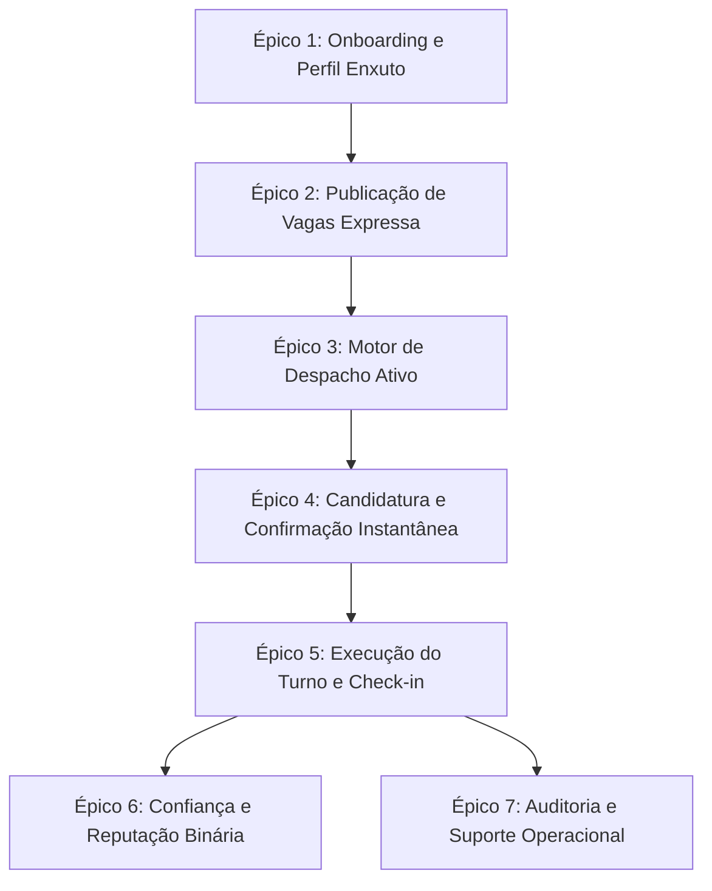

# 📋 Histórias de Usuário e Backlog do Produto — Frila

> **Documento de Engenharia de Requisitos & Produto**  
> **Autores**: Júlia Clovandi (Product Owner) e Fabrício Tosta (Product Designer)  
> **Equipe BlendOps**: Cauê Carneiro, Fabrício Tosta, João Paulo, Júlia Clovandi, Matheus Silva  
> **Desafio**: CBL C18 — Apple Developer Academy (UCB)  
> **Data**: 17 de setembro de 2026 | **Versão**: v1.0.0

---

## 1. Visão Geral e Metodologia

Este documento consolida a tradução funcional do [[01 - CBL/Desafios/C18/Documentos de Produto/Frila_Documento_de_Visao|Documento de Visão]] e da [[01 - CBL/Desafios/C18/Documentos de Produto/Frila_Documento_de_Requisitos|Especificação de Requisitos]] em **Histórias de Usuário (User Stories)** orientadas a valor e em um **Backlog do Produto priorizado via MoSCoW**.

O objetivo primordial é municiar a engenharia de software (Cauê Carneiro, JP e Matheus Silva) com especificações de comportamento verificáveis (BDD) e o design de produto (Fabrício Tosta) com os fluxos operacionais necessários para a prototipagem de baixa fidelidade (**T-0011**) e o MVP a ser avaliado na 1ª Apple Review em **28/09/2026**.

### 1.1 Critérios de Qualidade (INVEST)
Todas as histórias foram estruturadas segundo o acrônimo INVEST:
- **I (Independent)**: Redução ao máximo de acoplamento direto entre histórias para viabilizar entregas paralelas.
- **N (Negotiable)**: Espaço para ajustes de implementação acordados entre PO e engenharia.
- **V (Valuable)**: Benefício concreto e perceptível gerado para uma persona real do ecossistema.
- **E (Estimable)**: Escopo delimitado por critérios de aceitação objetivos em BDD.
- **S (Small)**: Granularidade adequada para sprints curtos de 1 a 2 semanas.
- **T (Testable)**: Critérios de aceitação binários no padrão *Dado / Quando / Então*.

### 1.2 Personas Mapeadas

| Persona | Perfil Operacional | Dor Central | Ganho Esperado no Frila |
|---|---|---|---|
| **Marcos** (Gerente de Bar/Restaurante) | Contratante de Food Service (40 turnos/mês) | O garçom faltou na sexta às 18h; WhatsApp é caótico e grupos não dão garantia de comparecimento. | Publicar turno em < 60s e ter profissional elegível e pontual confirmado em menos de 1 hora. |
| **Carla** (Produtora de Eventos) | Contratante de Eventos / Staff em Lote | Precisa fechar equipe de 15 pessoas para montagem/bar no fim de semana e prestar contas sem risco fiscal. | Escala em lote e relatório consolidado auditável de presença e valores combinados. |
| **Lucas** (Garçom Freelancer) | Profissional Operacional Avulso | Não fica sabendo das vagas a tempo; cansa de preencher cadastros longos e de levar calote ou pagar taxas abusivas. | Notificação direta no bolso com vaga perto de casa, candidatura em 1 toque e zero taxa cobrada dele. |
| **Roberta** (Operadora Frila) | Suporte e Monitoramento Interno | Turnos em risco que não encontram profissionais geram atrito na praça e perda de credibilidade. | Painel da janela crítica para visualizar gargalos e disparar intervenção manual antes que o cliente fique na mão. |

---

## 2. Estrutura de Épicos

O produto está organizado em **7 Épicos Centrais**:

1. **Épico 1: Onboarding e Perfil Operacional Enxuto** (RF01, RF02, RF03, RF21, RF25)
2. **Épico 2: Publicação e Gestão de Vagas Expressas** (RF04, RF05, RF19)
3. **Épico 3: Motor de Despacho Ativo e Matching** (RF06, RF07, RF18)
4. **Épico 4: Candidatura e Confirmação Instantânea** (RF08, RF09, RF10, RF11)
5. **Épico 5: Execução do Turno, Check-in e Contingência** (RF12, RF13, RF14)
6. **Épico 6: Confiança, Reputação Binária e Aval Herdado** (RF15, RF16, RF17)
7. **Épico 7: Auditoria, Prestação de Contas e Suporte Operacional** (RF20, RF22, RF23, RF24)

---

## 3. Detalhamento das Histórias de Usuário

---

### ÉPICO 1: Onboarding e Perfil Operacional Enxuto

#### US01: Cadastro Simples do Profissional com Declaração de Maioridade
- **Persona**: Lucas (Profissional Freelancer)
- **RF / RN**: RF01, RN14, RN15, RN20 | **Prioridade**: MUST HAVE | **Pontos**: 3
- **Narrativa**:
  > **Como** profissional freelancer operacional,  
  > **quero** me cadastrar no aplicativo informando apenas meu nome, telefone, e-mail e confirmando ter 18 anos ou mais,  
  > **para que** eu possa começar a receber convites de trabalho sem atritos burocráticos e sem expor fotos de documentos desnecessariamente.
- **Critérios de Aceitação (BDD)**:
  - **Cenário 1: Cadastro realizado com sucesso**  
    *Dado que* o profissional faz o primeiro acesso ao Frila iOS,  
    *quando* ele informa nome completo, telefone válido, e-mail, senha e marca o checkbox de confirmação de maioridade (≥ 18 anos),  
    *então* a conta é criada no estado ativo, o token de sessão é salvo no Keychain e ele é encaminhado para a definição de funções operacionais.
  - **Cenário 2: Tentativa de cadastro de menor de idade**  
    *Dado que* um usuário tenta avançar sem confirmar o checkbox de maioridade legal (RN20),  
    *quando* ele toca em "Continuar",  
    *então* o sistema bloqueia o envio e exibe a mensagem de que a plataforma é exclusiva para maiores de 18 anos.
  - **Cenário 3: Minimização de dados (LGPD)**  
    *Dado o* fluxo de cadastro do profissional,  
    *quando* o formulário é exibido,  
    *então* nenhuma foto de documento (RG/CNH) ou selfie com documento é solicitada (RN14).

---

#### US02: Configuração de Funções, Raio de Atuação e Janela de Disponibilidade
- **Persona**: Lucas (Profissional Freelancer)
- **RF / RN**: RF03, RN05 | **Prioridade**: MUST HAVE | **Pontos**: 3
- **Narrativa**:
  > **Como** profissional freelancer,  
  > **quero** selecionar as funções que sei desempenhar, meu endereço-base, raio máximo de deslocamento (em km) e os dias/turnos em que tenho disponibilidade,  
  > **para que** eu só seja notificado sobre vagas pertinentes ao meu trabalho e perto de onde estou.
- **Critérios de Aceitação (BDD)**:
  - **Cenário 1: Seleção de funções operacionais**  
    *Dado que* o profissional está na tela de configuração de perfil,  
    *quando* seleciona pelo menos uma função do catálogo oficial (ex: Garçom, Bartender) e define seu raio (ex: 15 km),  
    *então* os critérios de elegibilidade daquele perfil são atualizados no repositório.
  - **Cenário 2: Perfil sem funções selecionadas**  
    *Dado que* o profissional desmarca todas as funções operacionais,  
    *quando* tenta salvar o perfil,  
    *então* o sistema alerta que é obrigatório manter ao menos uma função ativa para receber despachos.

---

#### US03: Cadastro Ágil do Estabelecimento Contratante
- **Persona**: Marcos (Gerente de Restaurante) / Carla (Produtora)
- **RF / RN**: RF02, RN15, RN20 | **Prioridade**: MUST HAVE | **Pontos**: 3
- **Narrativa**:
  > **Como** contratante operacional,  
  > **quero** cadastrar meu estabelecimento com nome fantasia, razão social, documento (CNPJ/CPF), endereço completo e tipo de negócio,  
  > **para que** meu local esteja apto a publicar turnos avulsos e receba profissionais na coordenada geográfica correta.
- **Critérios de Aceitação (BDD)**:
  - **Cenário 1: Cadastro completo de bar/restaurante**  
    *Dado que* o contratante insere os dados da empresa e confirma o endereço,  
    *quando* o sistema valida os campos obrigatórios e obtém a latitude/longitude via geocodificação,  
    *então* o estabelecimento é registrado e o usuário logado é associado como Administrador.

---

### ÉPICO 2: Publicação e Gestão de Vagas Expressas

#### US04: Publicação de Turno Avulso em Menos de 60 Segundos
- **Persona**: Marcos (Gerente de Restaurante)
- **RF / RN**: RF04, RN02, RN03, RN18 | **Prioridade**: MUST HAVE | **Pontos**: 5
- **Narrativa**:
  > **Como** contratante com falta de pessoal imediata,  
  > **quero** publicar uma vaga preenchendo apenas função, data, horários, valor em reais e número de posições com endereço pré-carregado,  
  > **para que** eu resolva a reposição em menos de 1 minuto sem precisar de treinamento.
- **Critérios de Aceitação (BDD)**:
  - **Cenário 1: Publicação com endereço padrão**  
    *Dado que* Marcos abre a tela "Publicar Turno",  
    *quando* seleciona "Garçom", define início (18:00), término (00:00), valor (R$ 150,00) e 2 posições, mantendo o endereço pré-carregado do restaurante,  
    *então* a publicação é confirmada em até 3 toques, 2 registros de Posição são criados no banco e o despacho ativo é disparado imediatamente.
  - **Cenário 2: Validação de valor e horários inválidos**  
    *Dado que* o contratante tenta publicar uma vaga com valor igual a R$ 0,00 ou horário de término igual ao início,  
    *quando* toca em "Publicar",  
    *então* o sistema bloqueia e sinaliza especificamente os campos incorretos (RN02).

---

#### US05: Republicação de Vaga Anterior em 1 Toque
- **Persona**: Marcos (Gerente de Restaurante)
- **RF / RN**: RF05, RN02 | **Prioridade**: MUST HAVE | **Pontos**: 2
- **Narrativa**:
  > **Como** contratante recorrente,  
  > **quero** republicar um turno idêntico a um já realizado anteriormente apenas ajustando a data,  
  > **para que** eu economize tempo na escala rotineira do restaurante.
- **Critérios de Aceitação (BDD)**:
  - **Cenário 1: Reutilização de template**  
    *Dado que* Marcos acessa o histórico de vagas publicadas,  
    *quando* seleciona "Repetir Turno" em uma vaga de sexta-feira passada e escolhe a data de hoje,  
    *então* todos os dados (função, horários, valor e instruções) vêm preenchidos, bastando uma confirmação.

---

#### US06: Publicação de Escala de Evento em Lote
- **Persona**: Carla (Produtora de Eventos)
- **RF / RN**: RF19, RN02, RN18 | **Prioridade**: SHOULD HAVE | **Pontos**: 5
- **Narrativa**:
  > **Como** produtora de evento de grande porte,  
  > **quero** cadastrar um evento e publicar múltiplas vagas de diferentes funções simultaneamente (ex: 10 garçons, 4 bartenders, 6 montadores),  
  > **para que** eu escale toda a equipe operacional em um único processo centralizado.
- **Critérios de Aceitação (BDD)**:
  - **Cenário 1: Criação em lote**  
    *Dado que* Carla cria o evento "Festival de Música DF",  
    *quando* adiciona 3 categorias de vagas associadas à mesma data e local e confirma,  
    *então* o sistema gera todas as vagas e posições agrupadas sob o identificador do Evento, iniciando o despacho de cada função paralelamente.

---

### ÉPICO 3: Motor de Despacho Ativo e Matching

#### US07: Notificação Ativa em Levas Ordenada por Confiabilidade
- **Persona**: Lucas (Profissional) & Marcos (Contratante)
- **RF / RN**: RF06, RN04, RN05, RN06 | **Prioridade**: MUST HAVE | **Pontos**: 8
- **Narrativa**:
  > **Como** sistema Frila,  
  > **quero** selecionar profissionais elegíveis (função + raio + disponibilidade), priorizar a Equipe de Confiança e ordenar os demais pela maior taxa de comparecimento, enviando notificações push em levas sucessivas a cada 3 a 5 minutos,  
  > **para que** a vaga seja preenchida pelo trabalhador mais confiável com agilidade e sem gerar corrida desenfreada.
- **Critérios de Aceitação (BDD)**:
  - **Cenário 1: Despacho em levas ordenadas**  
    *Dado que* uma vaga de Garçom no Plano Piloto é publicada,  
    *quando* o `DespachoService` avalia a base de profissionais,  
    *então* os profissionais da Equipe de Confiança do restaurante recebem a 1ª leva em até 30 segundos; se a vaga não for preenchida, a 2ª leva é despachada para os profissionais com taxa de comparecimento > 95% dentro do raio.
  - **Cenário 2: Garantia de não notificar indisponíveis**  
    *Dado que* um profissional cadastrou que não trabalha aos sábados à noite,  
    *quando* uma vaga para sábado à noite for publicada na rua dele,  
    *então* o sistema não deve despachar a notificação para ele.

---

#### US08: Feed de Oportunidades Próximas para Busca Passiva
- **Persona**: Lucas (Profissional)
- **RF / RN**: RF07, RN05 | **Prioridade**: MUST HAVE | **Pontos**: 3
- **Narrativa**:
  > **Como** profissional que abriu o aplicativo proativamente,  
  > **quero** ver a lista de vagas abertas compatíveis com minhas funções e localizadas dentro do meu raio de atuação,  
  > **para que** eu encontre turnos extras mesmo se tiver perdido uma notificação push.
- **Critérios de Aceitação (BDD)**:
  - **Cenário 1: Listagem contextual**  
    *Dado que* Lucas abre a aba "Vagas Disponíveis",  
    *quando* a tela carrega em até 2 segundos,  
    *então* ele vê cards com função, valor líquido a receber, distância em km, horário e nome do estabelecimento contratante.

---

#### US09: Priorização da Equipe de Confiança no Despacho
- **Persona**: Marcos (Gerente de Bar)
- **RF / RN**: RF18, RN06 | **Prioridade**: SHOULD HAVE | **Pontos**: 3
- **Narrativa**:
  > **Como** contratante que já conhece bons profissionais,  
  > **quero** marcar profissionais como membros da minha "Equipe de Confiança",  
  > **para que** minhas novas vagas sejam ofertadas a eles com exclusividade na primeira leva de despacho.
- **Critérios de Aceitação (BDD)**:
  - **Cenário 1: Vaga ofertada primeiro para a equipe**  
    *Dado que* Marcos publicou um turno e possui 5 garçons na sua Equipe de Confiança,  
    *quando* o despacho inicia,  
    *então* esses 5 profissionais recebem a notificação 5 minutos antes da abertura geral para a praça.

---

### ÉPICO 4: Candidatura e Confirmação Instantânea

#### US10: Candidatura em Um Toque (Sem Currículo nem Chat)
- **Persona**: Lucas (Profissional)
- **RF / RN**: RF08, RN03 | **Prioridade**: MUST HAVE | **Pontos**: 3
- **Narrativa**:
  > **Como** profissional que recebeu a notificação de vaga,  
  > **quero** abrir o alerta e tocar em "Quero este Turno" com apenas 1 toque,  
  > **para que** eu garanta o trabalho imediatamente sem precisar enviar mensagem, currículo ou negociar valor.
- **Critérios de Aceitação (BDD)**:
  - **Cenário 1: Aceite instantâneo a partir da push**  
    *Dado que* Lucas toca na notificação recebida na tela de bloqueio,  
    *quando* visualiza os dados do turno e toca no botão principal "Aceitar Turno",  
    *então* sua candidatura é submetida em menos de 1 segundo sem formulários adicionais.

---

#### US11: Preenchimento Automático em Modo Urgência (First-Come, First-Served)
- **Persona**: Marcos (Contratante) & Lucas (Profissional)
- **RF / RN**: RF09, RF10, RN19 | **Prioridade**: MUST HAVE | **Pontos**: 5
- **Narrativa**:
  > **Como** contratante que publicou uma vaga urgente,  
  > **quero** que a posição seja confirmada automaticamente para o primeiro profissional elegível que aceitar,  
  > **para que** o turno seja fechado sem depender de eu parar meu serviço para aprovar manualmente.
- **Critérios de Aceitação (BDD)**:
  - **Cenário 1: Fechamento instantâneo da posição**  
    *Dado que* a vaga está configurada como "Modo Urgência",  
    *quando* Lucas confirma o aceite,  
    *então* o estado da posição muda imediatamente para `confirmada`, bloqueando outros acessos simultâneos (RN19) e encerrando o despacho daquela unidade.
  - **Cenário 2: Concorrência simultânea de dois profissionais**  
    *Dado que* dois profissionais tocam em aceitar no mesmo milissegundo,  
    *quando* a transação do banco for processada,  
    *então* apenas uma candidatura é confirmada (200 OK) e a outra recebe resposta imediata de que a posição acabou de ser preenchida (409 Conflict).

---

#### US12: Escolha de Candidatos em Modo Seleção
- **Persona**: Carla (Produtora de Eventos)
- **RF / RN**: RF09, RF10 | **Prioridade**: SHOULD HAVE | **Pontos**: 3
- **Narrativa**:
  > **Como** contratante com antecedência planejada,  
  > **quero** visualizar a lista de profissionais que manifestaram interesse e aprovar manualmente quem melhor se encaixa,  
  > **para que** eu selecione a equipe de acordo com o perfil do meu evento.
- **Critérios de Aceitação (BDD)**:
  - **Cenário 1: Seleção manual do profissional**  
    *Dado que* Carla abre uma vaga no "Modo Seleção" com 3 candidatos inscritos,  
    *quando* ela toca em "Confirmar" no perfil de Lucas,  
    *então* Lucas é alocado na posição e os demais candidatos são notificados com cordialidade de que as vagas foram preenchidas.

---

#### US13: Liberação de Contato Direto Pós-Confirmação
- **Persona**: Marcos (Contratante) & Lucas (Profissional)
- **RF / RN**: RF10, RF11, RN10 | **Prioridade**: MUST HAVE | **Pontos**: 3
- **Narrativa**:
  > **Como** participante de um turno confirmado,  
  > **quero** ter acesso ao link direto para WhatsApp e telefone da contraparte imediatamente após a confirmação,  
  > **para que** possamos alinhar detalhes operacionais práticos (ex: uniforme, portaria) sem intermediação de chat interno.
- **Critérios de Aceitação (BDD)**:
  - **Cenário 1: Liberação do botão de WhatsApp**  
    *Dado que* a posição foi confirmada entre Marcos e Lucas,  
    *quando* qualquer um deles abre os detalhes do turno,  
    *então* o botão "Conversar pelo WhatsApp" e o número de telefone ficam clicáveis para contato em 1 toque.
  - **Cenário 2: Proteção de privacidade pré-confirmação**  
    *Dado que* um profissional apenas recebeu a notificação ou está na lista de candidatos pendentes,  
    *quando* visualiza a vaga,  
    *então* nenhum telefone pessoal do contratante é exibido (RN10).

---

### ÉPICO 5: Execução do Turno, Check-in e Contingência

#### US14: Lembrete Inteligente Pré-Turno
- **Persona**: Lucas (Profissional) & Marcos (Contratante)
- **RF / RN**: RF12 | **Prioridade**: MUST HAVE | **Pontos**: 2
- **Narrativa**:
  > **Como** trabalhador ou gestor de turno,  
  > **quero** receber um lembrete push 2 horas antes do horário de início,  
  > **para que** eu não me esqueça do compromisso e confirme meu trajeto a tempo.
- **Critérios de Aceitação (BDD)**:
  - **Cenário 1: Envio do lembrete automatizado**  
    *Dado que* faltam exatamente 2 horas para o início do turno confirmado,  
    *quando* o agendador de tarefas executa,  
    *então* uma notificação com o horário, endereço exato e botão para abrir a rota no Apple Maps é enviada ao profissional.

---

#### US15: Check-in e Check-out com Verificação Geográfica
- **Persona**: Lucas (Profissional) & Marcos (Contratante)
- **RF / RN**: RF13, RN11, RN18 | **Prioridade**: MUST HAVE | **Pontos**: 5
- **Narrativa**:
  > **Como** profissional que chegou ao local (ou contratante que o recebeu),  
  > **quero** registrar o início e o término efetivo do turno com validação de geolocalização,  
  > **para que** haja auditoria transparente do horário trabalhado e mitigação de divergências.
- **Critérios de Aceitação (BDD)**:
  - **Cenário 1: Check-in no raio do estabelecimento**  
    *Dado que* Lucas está dentro de um raio de 200 metros do local do turno no horário previsto,  
    *quando* ele toca em "Fazer Check-in (Cheguei)",  
    *então* o sistema grava `inicio_registrado_em` com timestamp auditado e notifica o contratante.
  - **Cenário 2: Check-in fora do raio físico**  
    *Dado que* o profissional tenta fazer check-in a mais de 1 km de distância,  
    *quando* aciona o botão,  
    *então* o aplicativo alerta que ele precisa estar no local do evento para registrar o início.

---

#### US16: Cancelamento Justificado com Reabertura Imediata da Vaga
- **Persona**: Marcos (Contratante) ou Lucas (Profissional)
- **RF / RN**: RF14, RN12, RN13, RN16 | **Prioridade**: MUST HAVE | **Pontos**: 5
- **Narrativa**:
  > **Como** contratante que teve uma desistência (ou profissional com imprevisto legítimo),  
  > **quero** cancelar o turno informando obrigatoriamente o motivo, fazendo o sistema disparar novo despacho em até 30 segundos,  
  > **para que** a operação não fique descoberta e outra pessoa possa cobrir a vaga.
- **Critérios de Aceitação (BDD)**:
  - **Cenário 1: Cancelamento pelo profissional antes do início**  
    *Dado que* Lucas sofreu um imprevisto 3 horas antes do turno e clica em "Cancelar Turno",  
    *quando* seleciona o motivo e confirma,  
    *então* a posição é imediatamente liberada no banco, uma nova leva de despacho é disparada aos profissionais elegíveis em até 30 segundos e o contratante é avisado do re-despacho automático.
  - **Cenário 2: Impacto na taxa de comparecimento**  
    *Dado que* o cancelamento ocorreu dentro da janela crítica (menos de 2h) sem justificativa de força maior,  
    *quando* o cancelamento é processado,  
    *então* a ocorrência é anotada para recálculo da taxa de comparecimento do profissional (RN12).

---

### ÉPICO 6: Confiança, Reputação Binária e Aval Herdado

#### US17: Avaliação Binária Bidirecional Pós-Turno ("Chamaria de Novo?")
- **Persona**: Marcos (Contratante) & Lucas (Profissional)
- **RF / RN**: RF15, RN07 | **Prioridade**: MUST HAVE | **Pontos**: 3
- **Narrativa**:
  > **Como** contratante ou profissional após a conclusão do trabalho,  
  > **quero** responder a uma única pergunta objetiva (*"Você chamaria / trabalharia com ele novamente? Sim ou Não"*),  
  > **para que** construamos uma métrica honesta de reputação sem a poluição de notas subjetivas de 1 a 5 estrelas.
- **Critérios de Aceitação (BDD)**:
  - **Cenário 1: Avaliação liberada após o término**  
    *Dado que* o turno atingiu o horário previsto de encerramento,  
    *quando* as partes entram no app,  
    *então* uma janela modal apresenta exclusivamente duas opções: "Sim" (Verde) e "Não" (Cinza/Neutro). Nenhuma opção intermediária é fornecida.
  - **Cenário 2: Registro seguro**  
    *Dado que* a resposta foi enviada,  
    *quando* processada pelo backend,  
    *então* o sinal é incorporado ao score da contraparte e a tela de avaliação é encerrada definitivamente.

---

#### US18: Exibição Clara de Reputação com Denominador e Taxa de Presença
- **Persona**: Marcos (Contratante) & Lucas (Profissional)
- **RF / RN**: RF16, RN07, RN08 | **Prioridade**: MUST HAVE | **Pontos**: 3
- **Narrativa**:
  > **Como** usuário que precisa decidir com quem trabalhar,  
  > **quero** ver a reputação exibida como proporção real (ex: *"18 de 20 contratantes chamariam de novo"*) e a taxa de comparecimento calculada (ex: *"95% de presença"*),  
  > **para que** eu tenha clareza factual sobre o histórico do profissional sem notas infladas.
- **Critérios de Aceitação (BDD)**:
  - **Cenário 1: Perfil com histórico consolidado**  
    *Dado que* Lucas possui 12 turnos na plataforma com 11 recomendações positivas e 1 falta justificada,  
    *quando* Marcos visualiza seu card,  
    *então* o app exibe explicitamente: *"11 de 12 chamariam de novo"*, *"92% de comparecimento"*.
  - **Cenário 2: Profissional novo (Cold Start)**  
    *Dado que* o profissional está no seu 1º turno,  
    *quando* seu card é renderizado,  
    *então* é exibido o badge *"Novo na plataforma — sem histórico de turnos"*, e nunca "Nota Zero".

---

#### US19: Registro de Aval Externo Herdado
- **Persona**: Marcos (Contratante)
- **RF / RN**: RF17, RN08 | **Prioridade**: COULD HAVE | **Pontos**: 3
- **Narrativa**:
  > **Como** contratante que já conhece o trabalho do profissional fora do app,  
  > **quero** registrar um aval externo de confiança no perfil dele,  
  > **para que** ele tenha um sinal positivo inicial mesmo antes de acumular turnos no Frila.
- **Critérios de Aceitação (BDD)**:
  - **Cenário 1: Exibição separada de aval externo**  
    *Dado que* Marcos registrou um aval para Lucas,  
    *quando* outros estabelecimentos consultam o perfil de Lucas,  
    *então* o aval aparece em seção identificada: *"Recomendado por Restaurante X fora da plataforma"*, sem ser misturado à taxa de comparecimento interna.

---

### ÉPICO 7: Auditoria, Prestação de Contas e Suporte Operacional

#### US20: Exportação de Relatório Consolidado de Turnos Realizados
- **Persona**: Marcos (Food Service) & Carla (Campanhas / Eventos)
- **RF / RN**: RF22, RN11, RN17, RN18 | **Prioridade**: SHOULD HAVE | **Pontos**: 5
- **Narrativa**:
  > **Como** gestor financeiro ou produtor de evento/campanha,  
  > **quero** exportar um relatório em PDF ou CSV com todos os turnos executados, horários auditados, profissionais alocados e valores combinados,  
  > **para que** eu faça o fechamento contábil e a comprovação fiscal/eleitoral sem planilhas manuais.
- **Critérios de Aceitação (BDD)**:
  - **Cenário 1: Exportação de período contábil**  
    *Dado que* Carla seleciona o período "01/09 a 15/09" e clica em "Exportar Relatório",  
    *quando* o arquivo é gerado,  
    *então* o documento lista: Data, Horário Previsto, Horário Real (check-in/check-out), Nome do Profissional, Documento Parcial, Função e Valor Acordado em BRL.

---

#### US21: Painel Operacional de Monitoramento da Janela Crítica
- **Persona**: Roberta (Operadora Frila)
- **RF / RN**: RF20, RN12, RN13 | **Prioridade**: MUST HAVE (Versão Web Interna) | **Pontos**: 5
- **Narrativa**:
  > **Como** operadora interna do Frila,  
  > **quero** visualizar em tempo real as vagas abertas cujo início está a menos de 2 horas e que ainda não têm profissional confirmado,  
  > **para que** eu tome medidas ativas (ex: disparar levas extraordinárias ou contato direto) antes que o turno falhe.
- **Critérios de Aceitação (BDD)**:
  - **Cenário 1: Alerta de vaga em risco na janela crítica**  
    *Dado que* uma vaga para as 19:00 continua sem candidato às 17:15,  
    *quando* a operadora acessa o Painel de Operação,  
    *então* a vaga é destacada em vermelho com badge "Janela Crítica - 1h45m restantes", permitindo forçar ampliação de raio ou despacho imediato.

---

#### US22: Suporte Operacional Humanizado Durante o Turno
- **Persona**: Lucas (Profissional) & Marcos (Contratante)
- **RF / RN**: RF23, RN13 | **Prioridade**: SHOULD HAVE | **Pontos**: 3
- **Narrativa**:
  > **Como** usuário em execução de turno com imprevisto grave,  
  > **quero** acessar um canal de suporte ágil com atendimento humano,  
  > **para que** dúvidas ou problemas no local de trabalho sejam resolvidos rapidamente.
- **Critérios de Aceitação (BDD)**:
  - **Cenário 1: Abertura de chamado durante o turno**  
    *Dado que* o usuário clica em "Ajuda no Turno",  
    *quando* aciona o suporte,  
    *então* é encaminhado com contexto pré-preenchido (ID da vaga, nome e telefone) para a central de atendimento no WhatsApp de suporte.

---

#### US23: Transparência e Contestação de Suspensão
- **Persona**: Lucas (Profissional)
- **RF / RN**: RF24, RN13, RN16 | **Prioridade**: COULD HAVE | **Pontos**: 3
- **Narrativa**:
  > **Como** profissional que teve a conta suspensa temporariamente por cancelamentos sucessivos,  
  > **quero** ver o motivo detalhado e ter um botão de contestação com envio de justificativa/atestado,  
  > **para que** eu não sofra punições arbitrárias por motivos de força maior.
- **Critérios de Aceitação (BDD)**:
  - **Cenário 1: Visualização do motivo e contestação**  
    *Dado que* a conta está suspensa,  
    *quando* o profissional abre o app,  
    *então* uma tela clara explica as datas das faltas registradas e oferece formulário para envio de atestado ou defesa.

---

#### US24: Múltiplos Membros por Estabelecimento com Controle de Acesso
- **Persona**: Marcos (Proprietário)
- **RF / RN**: RF21, RN15 | **Prioridade**: COULD HAVE | **Pontos**: 3
- **Narrativa**:
  > **Como** dono de restaurante,  
  > **quero** convidar meus gerentes e maîtres para publicar e gerenciar turnos vinculados ao meu estabelecimento,  
  > **para que** a operação não dependa exclusivamente do meu aparelho celular.
- **Critérios de Aceitação (BDD)**:
  - **Cenário 1: Convidar gerente**  
    *Dado que* o administrador envia convite via e-mail para um colaborador,  
    *quando* o colaborador aceita,  
    *então* ele pode publicar e confirmar turnos em nome daquele estabelecimento.

---

#### US25: Exportação e Exclusão de Dados Pessoais (LGPD)
- **Persona**: Lucas (Profissional) & Marcos (Contratante)
- **RF / RN**: RF25, RN15 | **Prioridade**: SHOULD HAVE | **Pontos**: 3
- **Narrativa**:
  > **Como** usuário cadastrado,  
  > **quero** solicitar o download ou a exclusão definitiva dos meus dados pessoais a qualquer momento,  
  > **para que** minha privacidade seja respeitada em total conformidade com a LGPD.
- **Critérios de Aceitação (BDD)**:
  - **Cenário 1: Solicitação de exclusão de conta**  
    *Dado que* o usuário solicita a exclusão da conta no menu Privacidade,  
    *quando* não houver turnos futuros pendentes de execução,  
    *então* seus dados identificáveis são anonimizados e sua sessão é encerrada.

---

## 4. Matriz de Priorização MoSCoW (Backlog do MVP vs Releases Futuras)

A priorização orienta o que a equipe de engenharia e design deve entregar para a **1ª Apple Review (28/09)** e para a primeira versão da **App Store (Outubro/2026)**.

| Classificação MoSCoW | Critério Estratégico | Histórias de Usuário Incluídas |
|---|---|---|
| **MUST HAVE** *(Obrigatório para o MVP / 28/09)* | Funcionalidades indispensáveis para provar a tese de liquidez e confiabilidade: publicação < 60s, despacho em levas, aceite em 1 toque, modo urgência, canal de contato liberado, check-in e avaliação binária. | **US01, US02, US03, US04, US05, US07, US08, US10, US11, US13, US14, US15, US16, US17, US18, US21** (16 Histórias · ~63 Story Points) |
| **SHOULD HAVE** *(Versão 1.1 / Imediatamente pós-MVP)* | Recursos de alto valor para retenção e operação em escala, que entram assim que o fluxo core estiver estável. | **US06** (Escala em lote), **US09** (Equipe de confiança), **US12** (Modo seleção manual), **US20** (Relatório consolidado RN17), **US22** (Suporte durante turno), **US25** (LGPD) |
| **COULD HAVE** *(Versão 1.2 / Backlog futuro)* | Melhorias de conveniência operacional que não bloqueiam a validação de tração inicial. | **US19** (Aval externo herdado), **US23** (Contestação de suspensão), **US24** (Múltiplos usuários por estabelecimento) |
| **WON'T HAVE (NOW)** *(Fora de Escopo Deliberado)* | Elementos rejeitados conscientemente para mitigar riscos regulatórios, laborais e fricção de produto. | • Processamento ou custódia de pagamento in-app (RN09) • Cobrança de taxas ou mensalidades do profissional (RN01) • Chat interno embutido (substituído por WhatsApp direto pós-match) • Sistema de avaliação por 1 a 5 estrelas • Contratação CLT ou processo seletivo formal |

---

## 5. Rastreabilidade com Engenharia e Design

As histórias definidas mapeiam diretamente a arquitetura de código em Swift/SwiftUI documentada em [[07 - Arquitetura/Diagrama de Arquitetura|Diagrama de Arquitetura]] e [[07 - Arquitetura/Diagrama de Classe|Diagrama de Classe]]:

| Componente Técnico | Responsabilidade Primária | Histórias Atendidas |
|---|---|---|
| `PublicarVagaViewModel` | Orquestra tela de publicação, validação RN02 e templates | US04, US05, US06 |
| `DespachoService` / `ElegibilidadeSpec` | Seleção de raio, função, disponibilidade e despacho em levas | US02, US07, US09 |
| `FeedVagasViewModel` | Listagem por geolocalização e submissão de aceite com 1 toque | US08, US10, US11 |
| `TurnoManager` / `LocationService` | Check-in geolocalizado, lembretes pré-turno e encerramento | US14, US15, US16 |
| `ReputacaoService` | Cálculo da taxa de comparecimento e razão binária de recomendação | US17, US18, US19 |
| `RelatorioService` | Compilação e exportação de dados consolidados auditáveis (RN17) | US20 |
| `PainelOperacaoViewModel` | Monitoramento web da janela crítica e intervenções | US21, US22 |

---

## 6. Próximos Passos de Execução

1. **Alinhamento com Fabrício Tosta (**[[04 - Tarefas/T-0011 - Alinhar escopo e fluxos do protótipo de baixa fidelidade|T-0011]]**)**:
   - Utilizar as histórias do grupo **MUST HAVE** para desenhar os wireframes de baixa fidelidade das 5 jornadas principais.
2. **Distribuição com Engenharia (Cauê, JP e Matheus)**:
   - Abertura de issues e sprints técnicos a partir dos critérios BDD das US01, US04, US07, US10 e US15.
3. **Validação na 1ª Apple Review (28/09)**:
   - Apresentar o escopo do Backlog MoSCoW como evidência de priorização madura de PO/PM.

---
← [[04 - Tarefas/00 - Índice Tarefas|Índice de Tarefas]] · [[01 - CBL/Desafios/C18/Documentos de Produto/Frila_Documento_de_Requisitos|Documento de Requisitos]]
