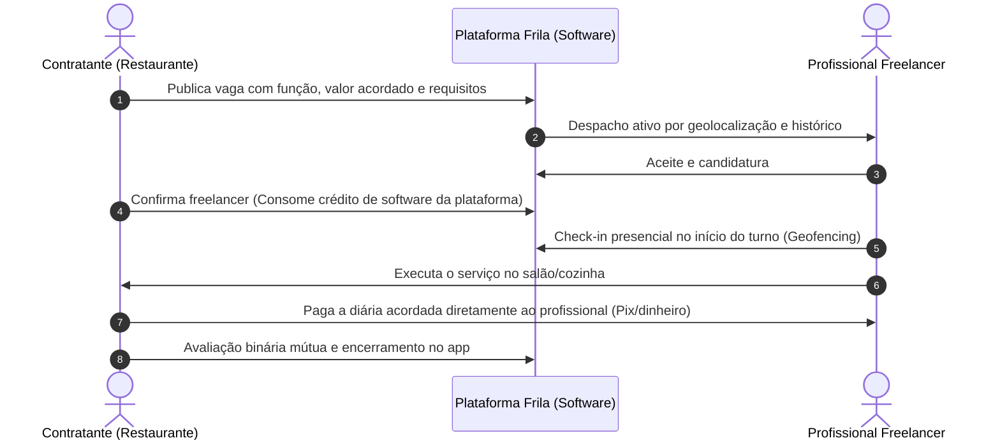

# Estruturar o modelo de negócio e monetização do Frila

## Contexto
O Frila conecta bares, restaurantes e estabelecimentos de eventos a profissionais freelancers no DF com agilidade e confiança mútua. Conforme definido no Documento de Visão e nos princípios fundamentais de produto:

> *"O pagamento fica fora do sistema por decisão de escopo, e não por limitação técnica. Eles combinam o pagamento da diária diretamente entre si."*

Esta tarefa consolida a definição formal do modelo de negócio para a **1ª Apple Review (28/09)**, demonstrando como a plataforma se sustenta financeiramente como um **software B2B de despacho e gestão de escala**, sem atuar como instituição de pagamento, custódia de diárias ou intermediador financeiro.

---

## Feito quando
- [x] Modelo de monetização definido sem intermediação de pagamentos das diárias (taxa de conexão de software por turno confirmado paga pelo estabelecimento vs. assinatura mensal SaaS de escala).
  > **Superado em 01/10/2026:** a v1.0 e o piloto não cobram nada de contratante nem de profissional, e não existe prioridade de despacho paga. O que este item descreve é hipótese para depois do piloto.
- [x] Fluxo de confirmação e registro de cumprimento especificado (como o turno é auditado sem a plataforma transacionar a diária do freelancer).
- [x] Business Model Canvas (BMC) do Frila alinhado à estratégia de SaaS B2B e zero taxa sobre o trabalhador.
- [x] Simulação básica de unit economics de software (receita por conexão, custos de tecnologia e ponto de equilíbrio no mercado do DF).
- [x] Seção de Modelo de Negócios integrada e documentada no vault.

---

## 1. Definição do Modelo de Monetização

### 1.1 Regra Inegociável de Posicionamento: Trabalhador não paga taxa
* **Profissional Freelancer:** Acesso 100% gratuito. Ele recebe o valor integral da diária diretamente do estabelecimento no salão (via Pix direto ou dinheiro ao fim do expediente). Nenhuma taxa de serviço ou intermediação é cobrada do trabalhador.

### 1.2 Modelo Adotado: SaaS B2B e Taxa de Conexão de Software (Contratante)

> **Superado em 01/10/2026:** a v1.0 e o piloto não cobram nada de contratante nem de profissional, e não existe prioridade de despacho paga. O que esta seção descreve (taxa por turno confirmado, créditos e assinatura com despacho prioritário) é hipótese formulada em 16/09/2026 para depois do piloto.

A plataforma monetiza cobrando **exclusivamente do estabelecimento contratante** pelo uso da tecnologia de despacho ativo e cobertura de urgência:

1. **Fase 1 — MVP / Validação no DF (1ª Apple Review): Taxa de Conexão por Turno Confirmado (Pay-per-Match)**
   - O estabelecimento paga uma taxa fixa de software de **R$ 15,00 a R$ 20,00 por turno preenchido e confirmado**.
   - O restaurante pode comprar pacotes de créditos pré-pagos (ex: pacote de 5 conexões por R$ 75,00) ou ser cobrado na confirmação do profissional.
   - Vagas publicadas que não forem preenchidas ou canceladas com antecedência **não consomem créditos**.

2. **Fase 2 — Escala e Recorrência: Assinatura Mensal de Escala ("Frila Pro")**
   - Para estabelecimentos com demanda recorrente (bares que contratam freelas todas as semanas e buffets de eventos):
   - **Planos de assinatura SaaS:** R$ 149,00 a R$ 249,00/mês, concedendo:
     - Publicações de vagas com despacho ativo prioritário ilimitado.
     - Gestão completa de escalas na versão Web.
     - Módulo de "Equipe de Confiança" (despacho primeiro para os profissionais favoritos do estabelecimento).

---

## 2. Mecânica de Confirmação e Registro (Sem Trânsito Financeiro)

Como a plataforma **não processa o dinheiro da diária**, o valor gerado pelo Frila está na **redução de no-show e no registro auditável do acordo**:

1. **Transparência do Acordo:** O valor ofertado no anúncio é fixado no momento da confirmação mútua, gerando um resumo de compromisso vinculante no aplicativo.
2. **Auditoria de Presença:** O aplicativo registra check-in no local por geofencing e check-out ao final do horário previsto.
3. **Liquidação Direta:** Ao término da jornada, o restaurante efetua o pagamento diretamente na chave Pix pessoal do freelancer no salão, como já é prática no mercado informal, mas agora com o histórico e horas de turno auditadas no app.
4. **Governança por Reputação:** A avaliação mútua ("Chamaria de novo?" / "Trabalharia de novo?") e a taxa de comparecimento alimentam o histórico permanente de ambos, incentivando pontualidade do trabalhador e pagamento correto pelo contratante.

---

## 3. Business Model Canvas (BMC) — Frila (SaaS B2B)

> **Superado em 01/10/2026:** a v1.0 e o piloto não cobram nada de contratante nem de profissional, e não existe prioridade de despacho paga. As fontes de receita e parcerias deste Canvas (taxa por conexão, assinaturas B2B) são hipóteses para depois do piloto.

| Bloco do Canvas | Definição Estratégica do Frila |
|---|---|
| **Proposta de Valor** | • **Para Contratantes:** Cobertura de furos em minutos sem parar o salão; despacho ativo por geolocalização; garantia de histórico verificável; eliminação da perda de faturamento por desfalque. • **Para Freelancers:** 100% gratuito; fim das vagas fakes de WhatsApp; previsibilidade de valor; histórico profissional portátil e valorizado. |
| **Segmentos de Clientes** | • Estabelecimentos de Food Service do DF (bares, hamburguerias, restaurantes, pizzarias). • Produtoras de eventos corporativos, feiras e buffets do DF. • Profissionais freelancers operacionais de salão, cozinha e apoio. |
| **Canais** | • Aplicativo móvel (iOS nativo e Android) e plataforma Web de gestão. • Parcerias institucionais com Abrasel-DF e sindicatos gastronômicos. • Comunidades de WhatsApp de hospitalidade do DF para atração de oferta. |
| **Relacionamento com Clientes** | • Autoatendimento rápido em menos de 60 segundos no celular. • Painel de Operação para monitoramento manual de turnos críticos. • Transparência e regras simples. |
| **Fontes de Receita** | • **Taxa de software por conexão confirmada (Pay-per-Match):** R$ 15,00 a R$ 20,00 paga pelo contratante. • **Assinatura mensal SaaS B2B:** R$ 149 a R$ 249/mês para bares e buffets recorrentes. |
| **Recursos-Chave** | • Motor de despacho ativo e algoritmo de elegibilidade geográfica. • Banco de dados de histórico e reputação binária dos profissionais do DF. • Sistema de notificações push de alta confiabilidade (APNs / FCM). |
| **Atividades-Chave** | • Algoritmo de matching e disparo de levas. • Validação e moderação de perfis. • Expansão e densidade de oferta/demanda no DF. |
| **Parcerias-Chave** | • Associações gastronômicas (Abrasel/DF). • Escolas técnicas de gastronomia (Senac DF). • Gateway de pagamento corporativo simples para cobrança de assinaturas B2B. |
| **Estrutura de Custos** | • Custos de infraestrutura cloud e servidores. • APIs de geolocalização e mapas. • Serviços de notificação push e mensageria. • Gastos locais de ativação e marketing no DF. *(Zero custo de split bancário e zero risco de chargeback de diárias)*. |

---

## 4. Simulação de Unit Economics de Software (Mercado do DF)

> **Superado em 01/10/2026:** a v1.0 e o piloto não cobram nada de contratante nem de profissional, e não existe prioridade de despacho paga. A simulação abaixo (receita por conexão e taxas sobre créditos) é hipótese para depois do piloto.

Com a eliminação da custódia financeira, os custos variáveis da plataforma caem drasticamente, gerando margens de software puro:

### 4.1 Premissas por Turno Conectado com Sucesso
- **Receita de Software por Turno Confirmado:** R$ 15,00
- **Custos Variáveis de Tecnologia por Turno:**
  - *Notificações Push / SMS para candidatos da leva:* R$ 0,50
  - *Consumo de Infraestrutura/Servidor/Mapas por Vaga:* R$ 0,35
  - *Taxa de cobrança do cartão do restaurante (pacote de créditos):* R$ 0,65
  - **Total de Custos Variáveis por Turno:** **R$ 1,50**
- **Margem de Contribuição Líquida Unitária:** **R$ 13,50 por turno (~90,0% de margem)**

### 4.2 Projeção de Ponto de Equilíbrio (Break-Even Operacional Inicial)
- **Custos Fixos Mensais Estimados (Servidores em nuvem, domínio e ferramentas):** ~R$ 2.000,00/mês
- **Volume de Turnos para Break-Even:**
  $$\text{Turnos/mês} = \frac{\text{R\$} 2.000,00}{\text{R\$} 13,50} \approx 148 \text{ turnos preenchidos/mês}$$
- **148 turnos por mês equivalem a menos de 5 turnos por dia em todo o Distrito Federal.** Isso comprova alta rentabilidade e baixíssimo risco de execução para o MVP.

---

## 5. Vantagens Estratégicas para a Apple Review

1. **Isenção de In-App Purchase da Apple:** A cobrança de ferramentas B2B corporativas e intermediação de serviços no mundo real físico não se sujeita à taxa de 30% da Apple para bens digitais.
   > **Superado em 01/10/2026:** a v1.0 e o piloto não cobram nada de contratante nem de profissional, e não existe prioridade de despacho paga. Na v1.0 e no piloto não há cobrança no app.
2. **Zero Risco Regulatório:** A plataforma não faz captação de recursos nem custódia financeira, operando em total conformidade com as normas do Banco Central.
3. **Zero Risco Trabalhista Solidário:** Ao não pagar a diária, o Frila afasta a caracterização de relação de emprego entre a plataforma e o profissional.
4. **Foco e Velocidade Técnica:** O time de engenharia foca na perfeição da experiência iOS nativa e no despacho por geolocalização, sem o atrito de gateways bancários.

---

## Notas
- 2026-09-15 — Tarefa criada para estruturar a entrega obrigatória de Modelo de Negócio da primeira Apple Review.
- 2026-09-16 — Modelo de negócio estruturado por Júlia Clovandi (PO/PM) com modelo SaaS B2B / Taxa de Conexão de Software (R$ 15/turno pago pelo estabelecimento), taxa zero ao freelancer, alinhamento estrito à decisão de não processar o pagamento das diárias, BMC completo e simulação de unit economics no DF (margem de 90%, break-even em ~5 turnos/dia). Tarefa concluída.
  > **Superado em 01/10/2026:** a v1.0 e o piloto não cobram nada de contratante nem de profissional, e não existe prioridade de despacho paga. O registro histórico acima reflete a formulação de 16/09/2026.

---
← [[04 - Tarefas/00 - Índice Tarefas|Índice de Tarefas]]
